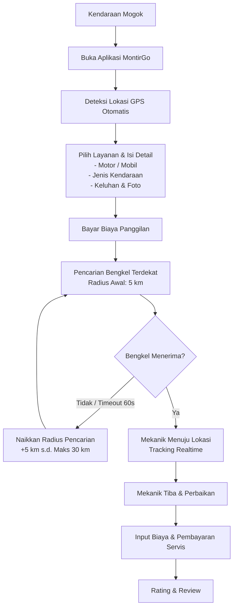

# MontirGo: Konsep & Spesifikasi Fitur Utama

MontirGo adalah platform *on-demand* yang menghubungkan pengendara yang mengalami kendala/mogok di jalan dengan bengkel atau mekanik terdekat secara *real-time*. Fokus utama aplikasi ini adalah memberikan solusi cepat, transparan, dan andal dalam situasi darurat kendaraan.

---

## 🔄 Alur Layanan (Flowchart)

Berikut adalah alur perjalanan pengguna dari saat kendaraan mengalami masalah hingga proses perbaikan selesai:

### 📡 Sistem Auto-Dispatch (Radius Escalation)
Untuk memastikan pengguna mendapatkan bantuan secepat mungkin, sistem pencarian bengkel menggunakan logika eskalasi radius otomatis:
* **Radius Awal:** 5 km.
* **Eskalasi:** Jika tidak ada bengkel menerima dalam waktu 3 menit, radius pencarian dinaikkan secara bertahap (10 km, 15 km, dst.) hingga batas maksimal **30 km**.
* **Timeout Order:** Setiap bengkel yang mendapatkan penawaran memiliki waktu **60 detik** untuk menerima sebelum order di-dispatch ke bengkel berikutnya.

---

## 📱 Arsitektur Aplikasi

Platform MontirGo terdiri dari tiga komponen utama:

### 1. Aplikasi Pengguna (User App)
Aplikasi mobile untuk pengendara yang membutuhkan bantuan darurat.
* **Autentikasi:** Login dan pendaftaran pengguna yang mudah.
* **Geolokasi (GPS):** Deteksi otomatis posisi pengguna secara presisi.
* **Formulir Order:** Pemilihan kategori kendaraan (Motor/Mobil), tipe/merk, deskripsi keluhan, serta opsi upload foto/video untuk membantu mekanik mengidentifikasi masalah lebih awal.
* **Sistem Pembayaran:** Pembayaran biaya panggilan awal terintegrasi.
* **Real-time Tracking:** Memantau pergerakan mekanik di peta secara langsung.
* **Komunikasi:** Fitur chat dan panggilan telepon dalam aplikasi dengan mekanik.
* **Riwayat Order:** Catatan riwayat servis dan biaya yang pernah dikeluarkan.
* **Ulasan:** Fitur rating dan review mekanik setelah layanan selesai.

### 2. Aplikasi Mitra/Bengkel (Partner App)
Aplikasi mobile untuk bengkel dan mekanik mandiri untuk menerima order.
* **Manajemen Status:** Pengaturan status Online/Offline untuk menerima order.
* **Notifikasi Order:** Sistem notifikasi instan dengan hitung mundur (*countdown*) 60 detik untuk menerima/menolak order masuk.
* **Navigasi Terintegrasi:** Navigasi penunjuk arah langsung menggunakan Google Maps/Waze menuju lokasi pengguna.
* **Komunikasi:** Chat dan telepon dengan pengguna.
* **Manajemen Servis & Biaya:**
  * Penginputan rincian biaya servis dan sparepart secara langsung di aplikasi.
  * Opsi upload foto kondisi kendaraan sebelum dan sesudah perbaikan sebagai bukti pengerjaan.
* **Dompet Digital (Finansial):** Riwayat pendapatan, saldo, dan riwayat order yang telah selesai.

### 3. Panel Admin Web (Admin Portal)
Dasbor berbasis web untuk mengelola dan memonitor seluruh operasional platform.
* **Manajemen Pengguna:** Verifikasi dan kelola akun pengguna, bengkel, serta mekanik.
* **Verifikasi Dokumen Mitra:** Proses onboarding dan kurasi keabsahan bengkel mitra baru.
* **Monitoring Real-time:** Memantau order aktif yang sedang berjalan dan melacak mekanik yang bertugas.
* **Manajemen Keuangan:**
  * Pengaturan persentase komisi platform.
  * Pemrosesan penarikan dana (*withdraw*) pendapatan bengkel.
  * Laporan keuangan dan transaksi secara menyeluruh.

---

## 💵 Skema Pembayaran & Bagi Hasil

Sistem keuangan MontirGo dibagi menjadi dua tahap transaksi:

### 1. Biaya Panggilan Awal (Callout Fee)
Biaya tetap yang dibayar pengguna saat memesan mekanik untuk datang ke lokasi.
* **Contoh Biaya Panggilan:** Rp25.000
* **Bagi Hasil:**
  | Pihak | Persentase / Nilai | Keterangan |
  | :--- | :--- | :--- |
  | **Mitra/Bengkel** | Rp20.000 (80%) | Jasa kunjungan mekanik ke lokasi |
  | **Platform (MontirGo)** | Rp5.000 (20%) | Biaya administrasi platform |

### 2. Biaya Perbaikan & Sparepart (Service Fee)
Biaya yang diinput oleh mekanik setelah melakukan diagnosis langsung di lokasi.
* **Contoh Rincian Biaya:**
  * Ganti Busi: Rp45.000
  * Oli Mesin: Rp80.000
  * Jasa Servis: Rp60.000
  * **Total Biaya Servis:** Rp185.000
* **Metode Pembayaran:** Tunai (Cash), QRIS, Transfer Bank, atau Saldo Dompet Digital Aplikasi.
* **Komisi Tambahan:** Platform dapat menetapkan potongan komisi tambahan (misal: 5-10%) dari total jasa servis jika pembayaran diproses secara nontunai di dalam aplikasi.

---

## 🗺️ Fitur Utama Tambahan

### 🚨 Tombol SOS / Darurat
Layanan cepat satu klik untuk kendala yang sangat spesifik dan membutuhkan penanganan segera tanpa perlu mengisi detail yang rumit. Kategori darurat meliputi:
* 🛞 Ban pecah / bocor (butuh tambal/ganti)
* 🔋 Aki soak (butuh *jumper* atau ganti baru)
* ⛽ Kehabisan bensin di jalan
* 🔑 Kunci tertinggal di dalam kendaraan
* 🌡️ Mesin overheat / Mogok total

### 🛠️ Pilihan Layanan Lengkap
Aplikasi mendukung berbagai kategori penanganan dari yang ringan hingga berat:
* Servis Berkala (Motor/Mobil)
* Jasa Tambal Ban & Ganti Oli
* Layanan Derek Mobil (Towing) untuk mogok berat
* Tune-up & Servis AC Mobil di tempat

---

## 💼 Model Bisnis (Monetisasi)

MontirGo memiliki beberapa sumber pendapatan utama:
1. **Komisi Biaya Panggilan:** Potongan tetap dari setiap pesanan awal yang berhasil.
2. **Komisi Transaksi Servis:** Persentase potongan dari jasa servis yang dibayar melalui aplikasi.
3. **Langganan Premium Bengkel:** Fitur berbayar bagi bengkel agar mendapatkan prioritas dispatch atau promosi di dalam aplikasi.
4. **Iklan Otomotif:** Kerjasama dengan brand oli, aki, ban, atau aksesoris untuk beriklan di aplikasi.
5. **Kemitraan B2B:** Kerja sama eksklusif dengan perusahaan asuransi kendaraan sebagai penyedia jasa emergency road assistance terpercaya.
6. **Marketplace Sparepart:** Penjualan suku cadang resmi langsung melalui aplikasi dengan sistem dropship atau gudang konsinyasi.

---

## 🎯 Strategi & Tantangan Terbesar

Tantangan utama platform ini adalah **efek jaringan dua sisi (two-sided network effect)**, yaitu membangun basis mitra bengkel yang cukup sebelum menarik minat pengguna.

* **Solusi Peluncuran Awal:**
  * Fokus peluncuran pada satu wilayah geografis yang spesifik terlebih dahulu (misalnya: **Mojokerto** dan sekitarnya).
  * Akuisisi mitra bengkel lokal secara intensif melalui edukasi dan jaminan pendapatan minimum selama masa promosi.
  * Setelah jaringan wilayah awal solid dan dipercaya, lakukan ekspansi bertahap ke kota-kota sekitar.
