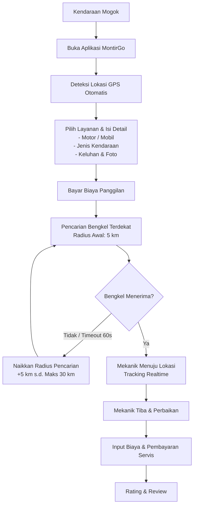

# MontirGo: Konsep & Spesifikasi Fitur Utama

MontirGo adalah platform *on-demand* yang menghubungkan pengendara yang mengalami kendala/mogok di jalan dengan bengkel atau mekanik terdekat secara *real-time*. Fokus utama aplikasi ini adalah memberikan solusi cepat, transparan, dan andal dalam situasi darurat kendaraan.

---

## Alur Layanan (Flowchart)

Berikut adalah alur perjalanan pengguna dari saat kendaraan mengalami masalah hingga proses perbaikan selesai:



### Sistem Auto-Dispatch (Radius Escalation + Kategori)
Untuk memastikan pengguna mendapatkan bantuan secepat mungkin, sistem pencarian bengkel menggunakan logika eskalasi radius otomatis dengan filter kategori kendaraan:
* **Filter Kategori Bengkel:** Dispatch hanya mengirim order ke bengkel dengan kategori yang sesuai (motor → bengkel motor/umum, mobil → bengkel mobil/umum).
* **Filter Service Radius:** Setiap bengkel memiliki radius layanan sendiri (default 30km). Order hanya diterima dari pelanggan dalam radius bengkel.
* **Filter Partner Status:** Hanya bengkel dengan status `online` yang menerima dispatch. Status lain: `on_the_way`, `in_progress`, `resting`, `closed`.
* **Matching Gejala (Symptom-Based):** Jika pelanggan memilih gejala dari wizard diagnosis, sistem mencocokkan dengan kategori layanan bengkel untuk dispatch yang lebih akurat.
* **Radius Awal:** 5 km.
* **Eskalasi:** Jika tidak ada bengkel menerima dalam waktu 3 menit, radius pencarian dinaikkan secara bertahap (10 km, 15 km, dst.) hingga batas maksimal **30 km**.
* **Timeout Order:** Setiap bengkel yang mendapatkan penawaran memiliki waktu **60 detik** untuk menerima sebelum order di-dispatch ke bengkel berikutnya.

---

## Arsitektur Aplikasi

Platform MontirGo terdiri dari tiga komponen utama:

### 1. Aplikasi Pengguna (User App)
Aplikasi mobile untuk pengendara yang membutuhkan bantuan darurat.
* **Autentikasi:** Login dan pendaftaran pengguna yang mudah.
* **Geolokasi (GPS):** Deteksi otomatis posisi pengguna secara presisi.
* **Profil Lengkap:** Pengguna wajib melengkapi profil minimal 80% sebelum bisa membuat order. Informasi yang diperlukan: nama, email, telepon, avatar, tanggal lahir, alamat, dan minimal 1 kendaraan terdaftar.
* **Kategori Kendaraan:** Pemisahan kategori kendaraan — Motor (matic, manual, bebek, sport, cub, electric) dan Mobil (sedan, SUV, MPV, hatchback, pickup, manual, automatic, diesel, hybrid, EV).
* **Wizard Diagnosis:** Pemilihan gejala masalah secara step-by-step berdasarkan kategori kendaraan, membantu mekanik memahami masalah sebelum datang ke lokasi.
* **Formulir Order:** Pemilihan kategori kendaraan, tipe/merk, deskripsi keluhan, gejala dari wizard diagnosis, serta opsi upload foto/video untuk membantu mekanik mengidentifikasi masalah lebih awal.
* **Sistem Pembayaran:** Pembayaran biaya panggilan awal terintegrasi.
* **Real-time Tracking:** Memantau pergerakan mekanik di peta secara langsung.
* **Komunikasi:** Fitur chat dan panggilan telepon dalam aplikasi dengan mekanik.
* **Riwayat Order:** Catatan riwayat servis dan biaya yang pernah dikeluarkan.
* **Ulasan:** Fitur rating dan review mekanik setelah layanan selesai.

### 2. Aplikasi Mitra/Bengkel (Partner App)
Aplikasi mobile untuk bengkel dan mekanik mandiri untuk menerima order.
* **Registrasi Terverifikasi:** Mitra bengkel harus melalui proses verifikasi admin. Status: `draft` → `pending` → `approved` (atau `rejected`/`suspended`). Mitra baru dimulai dengan status `draft` sampai profil lengkap.
* **Kategori Bengkel:** Setiap bengkel harus memilih kategori: Motor saja, Mobil saja, atau Keduanya. Dispatch hanya mengirim order sesuai kategori bengkel.
* **Profil Lengkap (100%):** Mitra wajib melengkapi profil 100% sebelum bisa menerima order. Termasuk: nama bengkel, alamat, GPS, kategori, nama pemilik, nomor HP pemilik, foto selfie dengan KTP, foto depan & dalam bengkel, data rekening bank, NPWP, NIB.
* **Service Radius:** Setiap bengkel bisa mengatur radius layanan sendiri (default 30km). Order hanya diterima dari pelanggan dalam radius yang ditentukan.
* **Manajemen Status Granular:** Status bengkel: Online, Dalam Perjalanan, Sedang Bekerja, Istirahat, Tutup. Hanya status "Online" yang menerima dispatch.
* **Multi-Mekanik:** Satu bengkel bisa memiliki multiple mekanik dengan data nama, foto, telepon, dan keahlian (motor/mobil/keduanya).
* **Manajemen Status:** Pengaturan status Online/Offline/Resting/Closed untuk menerima order.
* **Notifikasi Order:** Sistem notifikasi instan dengan hitung mundur (*countdown*) 60 detik untuk menerima/menolak order masuk.
* **Navigasi Terintegrasi:** Navigasi penunjuk arah langsung menggunakan Google Maps/Waze menuju lokasi pengguna.
* **Komunikasi:** Chat dan telepon dengan pengguna.
* **Manajemen Servis & Biaya:**
  * Penginputan rincian biaya servis dan sparepart secara langsung di aplikasi.
  * Kategori layanan bisa dikaitkan dengan tipe kendaraan (motor/mobil) untuk dispatch yang lebih akurat.
  * Opsi upload foto kondisi kendaraan sebelum dan sesudah perbaikan sebagai bukti pengerjaan.
* **Dompet Digital (Finansial):** Riwayat pendapatan, saldo, dan riwayat order yang telah selesai.

### 3. Panel Admin Web (Admin Portal)
Dasbor berbasis web untuk mengelola dan memonitor seluruh operasional platform.
* **Manajemen Pengguna:** Verifikasi dan kelola akun pengguna, bengkel, serta mekanik.
* **Verifikasi Dokumen Mitra:** Proses onboarding dan kurasi keabsahan bengkel mitra baru.
* **Monitoring Real-time:** Memantau order aktif yang sedang berjalan dan melacak mekanik yang bertugas.
* **Manajemen Keuangan:**
  * Pengaturan persentase komisi platform.
  * Pemrosesan penarikan dana (*withdraw*) pendapatan bengkel.
  * Laporan keuangan dan transaksi secara menyeluruh.

---

## Skema Pembayaran & Bagi Hasil

Sistem keuangan MontirGo menggunakan model bisnis **transaction-based** (seperti Gojek/Grab). **TIDAK ada subscription/langganan** untuk mitra bengkel.

### 1. Biaya Panggilan Awal (Callout Fee)
Biaya tetap yang dibayar pengguna saat memesan mekanik untuk datang ke lokasi.
* **Biaya Panggilan:** Rp30.000
* **Tujuan:** Mengurangi order palsu, menjamin mekanik mendapat kompensasi perjalanan, menunjukkan komitmen pengguna.

### 2. Biaya Perbaikan & Sparepart (Service Fee)
Biaya yang diinput oleh mekanik setelah melakukan diagnosis langsung di lokasi.
* **Contoh Rincian Biaya:**
  * Jasa: Rp100.000
  * Sparepart: Rp250.000
  * **Total Biaya Servis:** Rp350.000
* **Metode Pembayaran:** QRIS, Virtual Account, Transfer Bank, atau E-Wallet (semua melalui aplikasi).
* **Komisi Platform:** 5-10% dari total biaya servis — dipotong otomatis dari pembayaran user.

### 3. Alur Dana
```
User Bayar → Payment Gateway (Midtrans/Xendit) → Platform
→ Komisi platform dipotong otomatis (5-10%)
→ Sisa dana masuk saldo bengkel
→ Bengkel withdraw ke rekening bank
```

---

## Fitur Utama Tambahan

### Tombol SOS / Darurat
Layanan cepat satu klik untuk kendala yang sangat spesifik dan membutuhkan penanganan segera tanpa perlu mengisi detail yang rumit. Kategori darurat meliputi:
* Ban pecah / bocor (butuh tambal/ganti)
* Aki soak (butuh *jumper* atau ganti baru)
* Kehabisan bensin di jalan
* Kunci tertinggal di dalam kendaraan
* Mesin overheat / Mogok total

### Pilihan Layanan Lengkap
Aplikasi mendukung berbagai kategori penanganan dari yang ringan hingga berat:
* Servis Berkala (Motor/Mobil)
* Jasa Tambal Ban & Ganti Oli
* Layanan Derek Mobil (Towing) untuk mogok berat
* Tune-up & Servis AC Mobil di tempat

---

## Model Bisnis (Monetisasi)

MontirGo menggunakan model bisnis **transaction-based**. **Tidak ada subscription/langganan** untuk mitra bengkel — semua fitur gratis.

**Sumber Pendapatan Platform:**
1. **Callout Fee (Biaya Panggilan):** Rp30.000 per order — dibayar user saat buat order.
2. **Komisi Biaya Perbaikan:** 5-10% dari total biaya servis — dipotong otomatis dari pembayaran user.

**Potensi Pendapatan Masa Depan:**
3. **Iklan Otomotif:** Kerjasama dengan brand oli, aki, ban, atau aksesoris untuk beriklan di aplikasi.
4. **Kemitraan B2B:** Kerja sama eksklusif dengan perusahaan asuransi kendaraan sebagai penyedia jasa emergency road assistance terpercaya.
5. **Marketplace Sparepart:** Penjualan suku cadang resmi langsung melalui aplikasi dengan sistem dropship atau gudang konsinyasi.

---

## Strategi & Tantangan Terbesar

Tantangan utama platform ini adalah **efek jaringan dua sisi (two-sided network effect)**, yaitu membangun basis mitra bengkel yang cukup sebelum menarik minat pengguna.

* **Solusi Peluncuran Awal:**
  * Fokus peluncuran pada satu wilayah geografis yang spesifik terlebih dahulu (misalnya: **Mojokerto** dan sekitarnya).
  * Akuisisi mitra bengkel lokal secara intensif melalui edukasi dan jaminan pendapatan minimum selama masa promosi.
  * Setelah jaringan wilayah awal solid dan dipercaya, lakukan ekspansi bertahap ke kota-kota sekitar.
