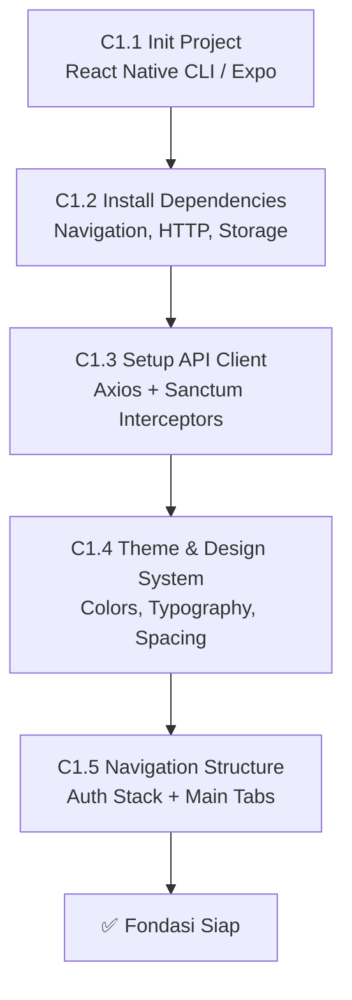
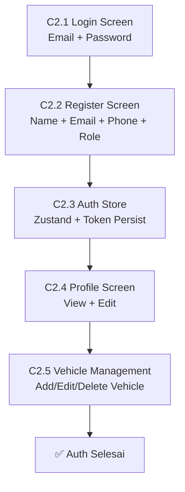
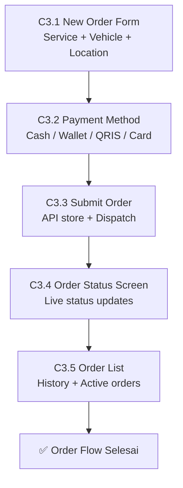
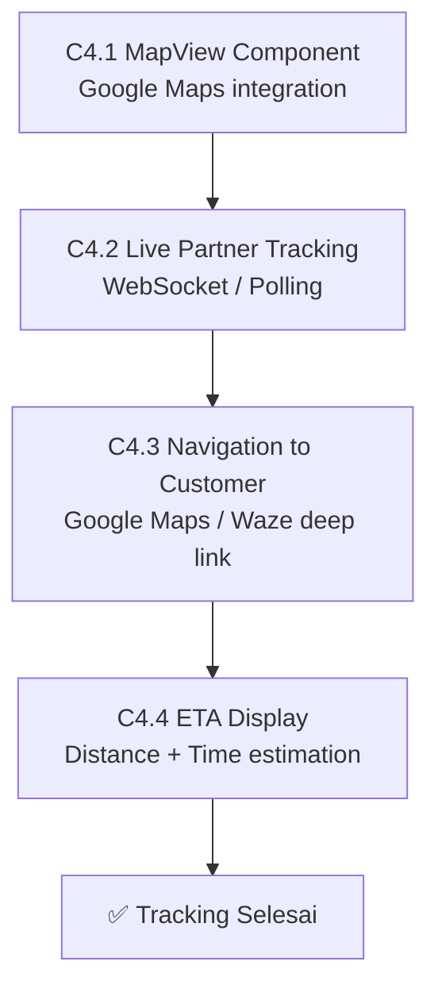
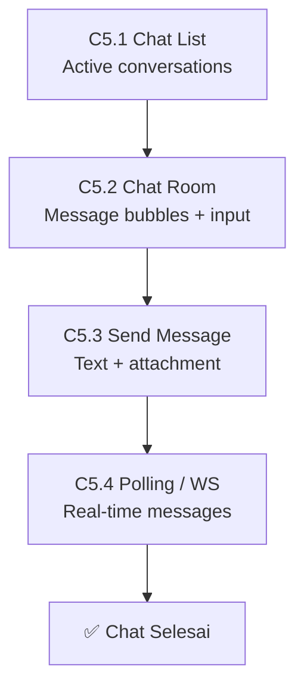
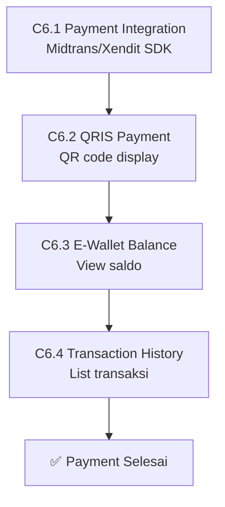
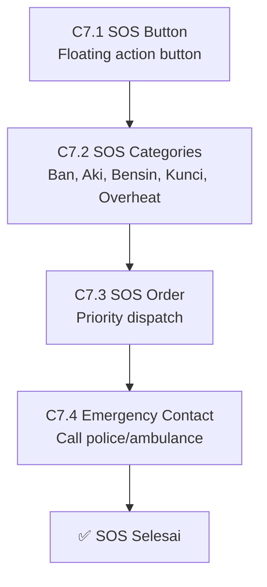
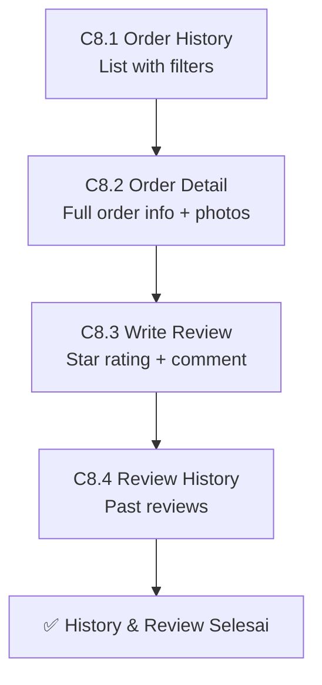
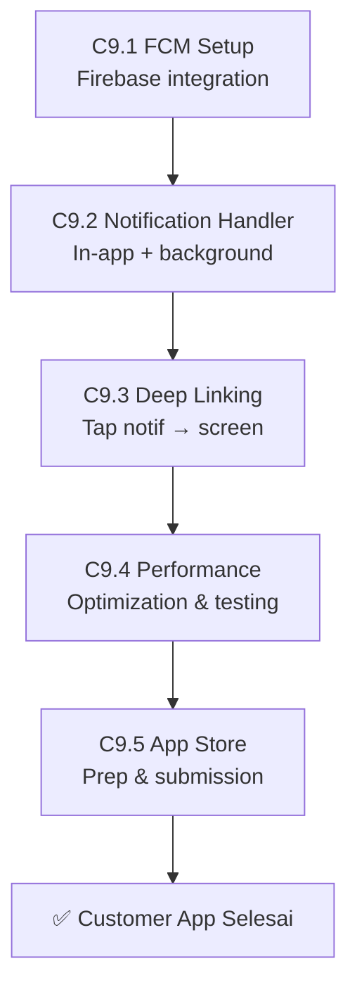

# MontirGo — Roadmap Aplikasi Customer (React Native)

> **Platform:** React Native (iOS + Android)  
> **Backend API:** Laravel v13 + Sanctum Auth  
> **API Docs:** [`REST-API.md`](REST-API.md)  
> **Base URL:** `https://montirgo.test/api/v1`

---

## Status Proyek

| FASE | Nama | Status |
|:---|:---|:---|
| **C1** | Fondasi & Setup | ⬜ Pending |
| **C2** | Autentikasi & Profil | ⬜ Pending |
| **C3** | Order Flow & Dispatch | ⬜ Pending |
| **C4** | Real-time Tracking & Maps | ⬜ Pending |
| **C5** | Chat & Komunikasi | ⬜ Pending |
| **C6** | Pembayaran & Wallet | ⬜ Pending |
| **C7** | SOS Darurat | ⬜ Pending |
| **C8** | Riwayat & Review | ⬜ Pending |
| **C9** | Push Notification & Polish | ⬜ Pending |

---

## Tech Stack

| Layer | Technology | Keterangan |
|:---|:---|:---|
| Framework | React Native 0.76+ | Cross-platform (iOS + Android) |
| State Management | Zustand / Redux Toolkit | Lightweight global state |
| Navigation | React Navigation v7 | Stack, Tab, Modal |
| Maps | `react-native-maps` | Google Maps provider |
| HTTP Client | Axios | API calls + interceptors |
| Auth Storage | `@react-native-async-storage/async-storage` | Token persist |
| Push | `@react-native-firebase/messaging` | FCM push notification |
| Camera/Media | `react-native-image-picker` | Upload foto keluhan |
| Real-time | Socket.IO / Laravel Reverb WS | Live tracking |
| UI Kit | React Native Paper / NativeWind | Consistent design system |

---

## 📁 Struktur Proyek

```
montirgo-customer/
├── src/
│   ├── api/                    # API service functions
│   │   ├── client.ts           # Axios instance + interceptors
│   │   ├── auth.api.ts
│   │   ├── order.api.ts
│   │   ├── partner.api.ts
│   │   ├── chat.api.ts
│   │   ├── wallet.api.ts
│   │   └── notification.api.ts
│   ├── components/             # Reusable UI components
│   │   ├── ui/                 # Buttons, Cards, Inputs
│   │   ├── maps/               # MapView, Marker, Route
│   │   └── order/              # OrderCard, StatusBadge
│   ├── screens/                # Screen pages
│   │   ├── auth/
│   │   ├── home/
│   │   ├── order/
│   │   ├── tracking/
│   │   ├── chat/
│   │   ├── payment/
│   │   ├── history/
│   │   ├── review/
│   │   ├── sos/
│   │   └── profile/
│   ├── navigation/             # Navigation config
│   ├── stores/                 # Zustand stores
│   ├── hooks/                  # Custom hooks
│   ├── utils/                  # Helpers, constants
│   └── types/                  # TypeScript types
├── android/
├── ios/
├── app.json
├── package.json
└── tsconfig.json
```

---

## FASE C1 — Fondasi & Setup



### Detail Tasks

| ID | Task | Output | Estimasi |
|:---|:---|:---|:---|
| C1.1 | Init React Native project | Project runnable di simulator | 0.5 hari |
| C1.2 | Install dependencies | Navigation, Axios, AsyncStorage, Maps, Firebase | 0.5 hari |
| C1.3 | Setup API client | Axios instance dengan base URL, token interceptor, error handler | 1 hari |
| C1.4 | Theme & Design System | Colors (primary orange/blue), Typography, Spacing, komponen dasar | 1 hari |
| C1.5 | Navigation structure | AuthStack (Login, Register) + MainTabs (Home, Orders, Profile) | 1 hari |

### Rincian

**C1.3 — API Client Setup:**
```typescript
// src/api/client.ts
const apiClient = axios.create({
  baseURL: 'https://montirgo.test/api/v1',
  headers: { 'Accept': 'application/json', 'Content-Type': 'application/json' },
});

// Request interceptor — attach token
apiClient.interceptors.request.use(async (config) => {
  const token = await AsyncStorage.getItem('auth_token');
  if (token) config.headers.Authorization = `Bearer ${token}`;
  return config;
});

// Response interceptor — handle 401
apiClient.interceptors.response.use(
  (res) => res,
  async (error) => {
    if (error.response?.status === 401) {
      await AsyncStorage.removeItem('auth_token');
      NavigationService.navigate('Login');
    }
    return Promise.reject(error);
  }
);
```

**C1.5 — Navigation Structure:**
```
RootStack
├── AuthStack (not authenticated)
│   ├── LoginScreen
│   ├── RegisterScreen
│   └── ForgotPasswordScreen
└── MainTabs (authenticated)
    ├── HomeTab
    │   └── HomeScreen (quick actions)
    ├── OrdersTab
    │   ├── OrdersListScreen
    │   └── OrderDetailScreen
    ├── SOSTab (floating button)
    │   └── SOSScreen
    ├── ChatTab
    │   └── ChatListScreen
    └── ProfileTab
        ├── ProfileScreen
        ├── EditProfileScreen
        ├── VehicleScreen
        └── SettingsScreen
```

---

## FASE C2 — Autentikasi & Profil



### Detail Tasks

| ID | Task | Output | API Endpoint |
|:---|:---|:---|:---|
| C2.1 | Login screen | Form email + password, error handling | `POST /v1/auth/login` |
| C2.2 | Register screen | Form name + email + phone + password + role | `POST /v1/auth/register` |
| C2.3 | Auth store (Zustand) | Token persist, auto-login, logout | — |
| C2.4 | Profile screen | View profil, edit nama/phone/avatar | `GET/PATCH /v1/auth/profile` |
| C2.5 | Vehicle management | CRUD kendaraan (brand, model, plate, type) | Client-side + sync |

### Rincian

- **Auto-login:** Cek token di AsyncStorage saat app start → jika valid, skip login
- **Logout:** Hapus token + clear store → redirect ke LoginScreen
- **Form Validation:** Client-side validation sebelum API call
- **Error Toast:** Tampilkan error message dari API response

---

## FASE C3 — Order Flow & Dispatch



### Detail Tasks

| ID | Task | Output | API Endpoint |
|:---|:---|:---|:---|
| C3.1 | New order form | Service type, vehicle picker, problem description, location pin | `POST /v1/orders` |
| C3.2 | Payment method picker | Cash, Wallet, QRIS, Card selection | — |
| C3.3 | Submit order | Create order + trigger dispatch + show loading | `POST /v1/orders` |
| C3.4 | Order status screen | Real-time status badge, partner info, ETA | `GET /v1/orders/{id}` |
| C3.5 | Orders list | Tab: Active / Completed / Cancelled | `GET /v1/orders?status=` |

### Rincian

**C3.1 — New Order Form Flow:**
```
1. Auto-detect GPS location (react-native-maps)
2. Confirm/adjust location on map (drag pin)
3. Enter address (optional, geocoded from pin)
4. Select vehicle (from saved vehicles list)
5. Select service type (dropdown)
6. Enter problem description (textarea)
7. Select payment method
8. Review & Submit
```

**C3.4 — Order Status Flow:**
```
pending → dispatching → accepted → on_the_way → arrived → in_progress → completed
                                                          ↓
                                                    cancelled (by customer)
```

**Status Labels & Colors:**
| Status | Label | Color |
|:---|:---|:---|
| `pending` | Menunggu | Yellow |
| `dispatching` | Mencari Mekanik | Orange |
| `accepted` | Diterima | Blue |
| `on_the_way` | Dalam Perjalanan | Indigo |
| `arrived` | Tiba di Lokasi | Purple |
| `in_progress` | Sedang Dikerjakan | Orange |
| `completed` | Selesai | Green |
| `cancelled` | Dibatalkan | Gray |

---

## FASE C4 — Real-time Tracking & Maps



### Detail Tasks

| ID | Task | Output | API Endpoint |
|:---|:---|:---|:---|
| C4.1 | MapView component | Full-screen map with partner marker, customer marker, route line | — |
| C4.2 | Live partner tracking | WebSocket/polling update partner position setiap 5 detik | Broadcast `partner-location` |
| C4.3 | Deep link navigation | Buka Google Maps / Waze ke lokasi partner | — |
| C4.4 | ETA display | Tampilkan jarak + estimasi waktu tiba | `GET /v1/partner/orders/{id}/track` |

### Rincian

- **WebSocket Channel:** `private-order.{orderId}` untuk status changes
- **Fallback:** Jika WebSocket gagal, poll `GET /v1/orders/{id}` setiap 10 detik
- **Map Markers:**
  - 🔵 Blue marker = Customer (fixed)
  - 🟠 Orange marker = Partner/Mekanik (moving)
  - 🟢 Green marker = Destination
- **Route Line:** Polyline dari partner ke customer (Google Directions API)

---

## FASE C5 — Chat & Komunikasi



### Detail Tasks

| ID | Task | Output | API Endpoint |
|:---|:---|:---|:---|
| C5.1 | Chat list screen | Daftar chat rooms dengan last message + unread badge | `GET /v1/orders/{id}/chat` |
| C5.2 | Chat room screen | Message bubbles (sent/received), timestamp, scroll | — |
| C5.3 | Send message | Text input + send button + image attachment | `POST /v1/orders/{id}/chat/send` |
| C5.4 | Real-time polling | Poll new messages setiap 3 detik atau WebSocket | `GET /v1/orders/{id}/chat/poll` |

### Rincian

- **Message Bubble Layout:**
  - Sent (right, blue bg): `Flex-end`
  - Received (left, gray bg): `Flex-start`
- **Attachment:** Image thumbnail (tap to full screen)
- **Unread Badge:** Counter di tab icon + chat list item
- **Keyboard Handling:** `KeyboardAvoidingView` + `ScrollView` with `inverted` FlatList

---

## FASE C6 — Pembayaran & Wallet



### Detail Tasks

| ID | Task | Output | API Endpoint |
|:---|:---|:---|:---|
| C6.1 | Payment integration | Midtrans/Xendit SDK (Snap) untuk card & bank transfer | `POST /v1/orders` |
| C6.2 | QRIS payment | Generate QR code dari payment gateway | Payment gateway response |
| C6.3 | Wallet balance | Tampilkan saldo wallet | `GET /v1/wallet` |
| C6.4 | Transaction history | Riwayat transaksi + filter | `GET /v1/wallet/transactions` |

### Rincian

- **Payment Flow:**
  1. Customer pilih metode bayar saat buat order
  2. Jika non-cash → buka Midtrans Snap (webview/in-app)
  3. Tunggu callback status → update order status
  4. Tampilkan receipt

- **Supported Payment Methods:**
  | Method | Tipe | SDK |
  |:---|:---|:---|
  | Cash | Tunai | — |
  | QRIS | QR Code | Midtrans QRIS |
  | Card | Credit/Debit | Midtrans Snap |
  | E-Wallet | GoPay/OVO/Dana | Midtrans Snap |
  | Bank Transfer | VA | Midtrans Snap |

---

## FASE C7 — SOS Darurat



### Detail Tasks

| ID | Task | Output | API Endpoint |
|:---|:---|:---|:---|
| C7.1 | SOS floating button | Red button di home screen, konfirmasi dialog | — |
| C7.2 | SOS categories | Pilih jenis darurat (5 kategori) | — |
| C7.3 | SOS order submit | Priority dispatch dengan wider radius | `POST /v1/sos` |
| C7.4 | Emergency contacts | Quick call: Polisi (110), Ambulance (118), Darurat (119) | — |

### Rincian

**SOS Categories:**
| Code | Label | Icon | Description |
|:---|:---|:---|:---|
| `flat_tire` | Ban Kembung | ellipse-outline | Ban bocor atau kempes |
| `dead_battery` | Aki Mati | battery-dead-outline | Mesin tidak bisa menyala |
| `out_of_fuel` | Kehabisan Bensin | water-outline | BBM habis di jalan |
| `locked_keys` | Kunci Tertinggal | key-outline | Kunci tertinggal di dalam kendaraan |
| `overheat` | Mesin Overheat | thermometer-outline | Mesin terlalu panas |

- **Priority Dispatch:** SOS order di-dispatch ke semua partner dalam radius 15km secara serentak
- **Auto-location:** GPS lokasi otomatis terdeteksi, tidak perlu input manual
- **Vibration Alert:** Phone bergetar saat order SOS berhasil dikirim

---

## FASE C8 — Riwayat & Review



### Detail Tasks

| ID | Task | Output | API Endpoint |
|:---|:---|:---|:---|
| C8.1 | Order history list | Filter by status, date range, search | `GET /v1/orders?status=` |
| C8.2 | Order detail screen | Full info: partner, vehicle, cost, photos, timeline | `GET /v1/orders/{id}` |
| C8.3 | Write review | Star rating (1-5), text comment, submit | Client-side + API |
| C8.4 | Review history | Daftar review yang sudah ditulis | Client-side |

### Rincian

- **Order Timeline:** Visual timeline status changes (pending → completed)
- **Photos Section:** Tampilkan foto before/after yang diupload partner
- **Receipt:** Ringkasan biaya: callout fee + service fee + total
- **Review Modal:** Popup setelah order completed, bisa di-skip dan diisi nanti

---

## FASE C9 — Push Notification & Polish



### Detail Tasks

| ID | Task | Output | API Endpoint |
|:---|:---|:---|:---|
| C9.1 | FCM setup | Firebase config, token registration | `POST /v1/fcm-token` |
| C9.2 | Notification handler | Foreground: in-app banner, Background: system notif | — |
| C9.3 | Deep linking | Tap notif → buka screen terkait (order detail, chat) | — |
| C9.4 | Performance optimization | Image caching, lazy loading, memory optimization | — |
| C9.5 | App Store preparation | Screenshots, description, privacy policy, build release | — |

### Rincian

**Notification Types:**
| Event | Title | Body | Deep Link |
|:---|:---|:---|:---|
| Order Accepted | Mekanik Ditemukan | `{partner} menerima order Anda` | Order Detail |
| Partner On The Way | Mekanik Berangkat | `{partner} sedang menuju lokasi Anda` | Order Detail |
| Partner Arrived | Mekanik Tiba | `{partner} telah tiba di lokasi Anda` | Order Detail |
| Order Completed | Order Selesai | Biaya servis: Rp {amount} | Order Detail |
| New Chat | Pesan Baru | {sender}: {preview} | Chat Room |

---

## Urutan Eksekusi

```mermaid
graph LR
    subgraph "Minggu 1"
        C1[C1: Fondasi]
    end
    subgraph "Minggu 2"
        C2[C2: Auth & Profil]
    end
    subgraph "Minggu 3-4"
        C3[C3: Order Flow]
    end
    subgraph "Minggu 4-5"
        C4[C4: Tracking & Maps]
    end
    subgraph "Minggu 5"
        C5[C5: Chat]
    end
    subgraph "Minggu 6"
        C6[C6: Pembayaran]
    end
    subgraph "Minggu 6"
        C7[C7: SOS]
    end
    subgraph "Minggu 7"
        C8[C8: History & Review]
    end
    subgraph "Minggu 8"
        C9[C9: Push & Polish]
    end

    C1 --> C2 --> C3 --> C4 --> C5 --> C6 --> C7 --> C8 --> C9
```



---

## Milestones

| Milestone | FASE | Deliverable |
|:---|:---|:---|
| **CM1 — App Runs** | C1 | Project setup + navigation + API client berjalan |
| **CM2 — User Can Login** | C1-C2 | Register + Login + Profile berfungsi |
| **CM3 — Can Order** | C3 | Buat order + lihat status + bayar |
| **CM4 — Live Tracking** | C4 | Track mekanik di peta real-time |
| **CM5 — Full MVP** | C5-C7 | Chat + Payment + SOS berfungsi |
| **CM6 — App Store Ready** | C8-C9 | History + Review + Push + Release build |

---

## Screen Flow Summary

```
┌─────────────────────────────────────────────┐
│                SPLASH SCREEN                │
│            (check auth token)               │
└──────────────────┬──────────────────────────┘
                   │
         ┌─────────┴─────────┐
         │ NOT AUTHENTICATED │
         └─────────┬─────────┘
                   │
    ┌──────────────┼──────────────┐
    │              │              │
┌───┴───┐    ┌────┴────┐   ┌────┴────┐
│ LOGIN │    │REGISTER │   │ FORGOT  │
└───┬───┘    └────┬────┘   │  PASS   │
    │              │        └─────────┘
    └──────────────┘
                   │
         ┌─────────┴─────────┐
         │   AUTHENTICATED   │
         └─────────┬─────────┘
                   │
    ┌──────────────┼──────────────┬──────────────┬──────────────┐
    │              │              │              │              │
┌───┴───┐    ┌────┴────┐   ┌────┴────┐   ┌────┴────┐   ┌────┴────┐
│ HOME  │    │ ORDERS  │   │  SOS    │   │  CHAT   │   │ PROFILE │
│       │    │ (tabs)  │   │ (float) │   │ (tabs)  │   │ (tabs)  │
│ • Quick│    │ • List  │   │         │   │ • List  │   │ • Info  │
│  Actions│   │ • Detail│   │         │   │ • Room  │   │ • Edit  │
│ • Map  │    │ • Create│   │         │   │         │   │ • Vehicle│
│ • Ads  │    │         │   │         │   │         │   │ • Wallet │
└───────┘    └─────────┘   └─────────┘   └─────────┘   └─────────┘
```

---

> **Last Updated:** 17 Juli 2026
> **Backend Ready:** ✅ (FASE 1-9 selesai)  
> **API Endpoints:** 30+ (lihat [`REST-API.md`](REST-API.md))
