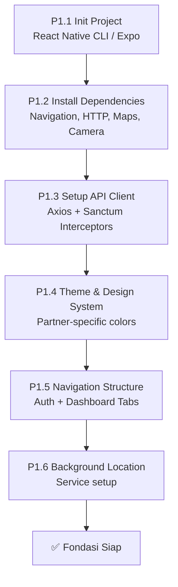
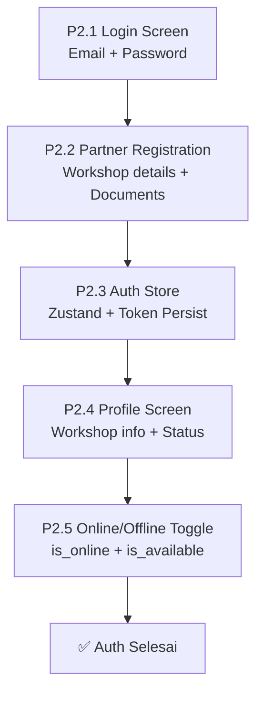
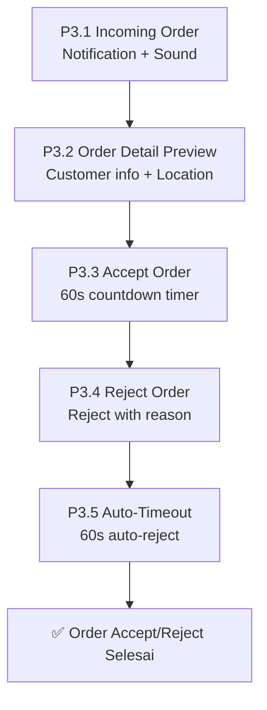
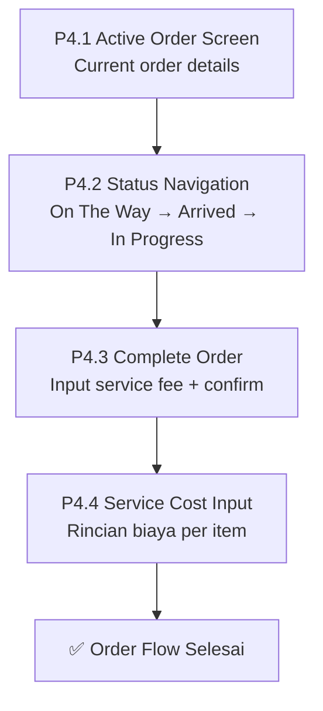
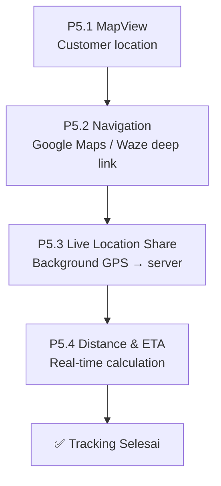
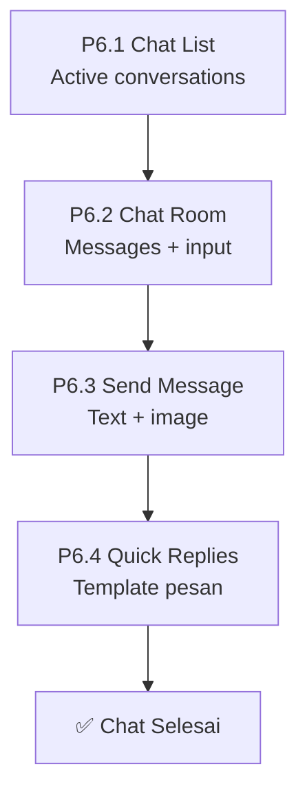
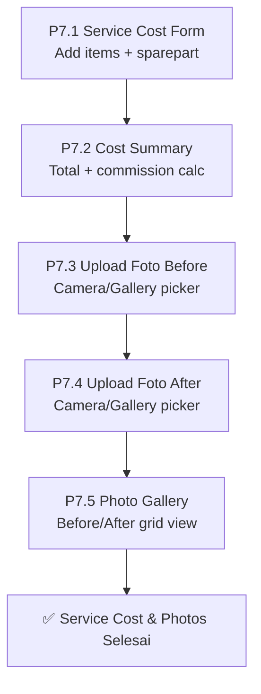
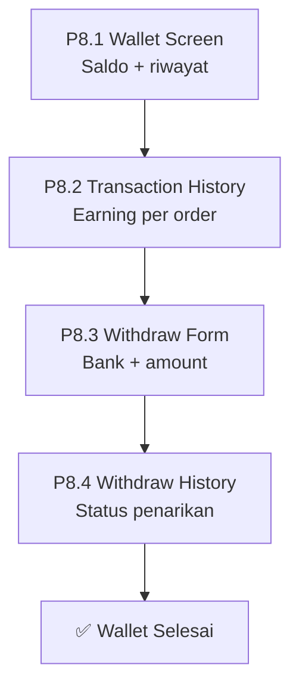
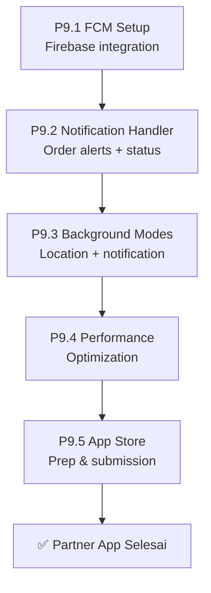

# MontirGo — Roadmap Aplikasi Partner/Bengkel (React Native)

> **Platform:** React Native (iOS + Android)  
> **Backend API:** Laravel v13 + Sanctum Auth  
> **API Docs:** [`REST-API.md`](REST-API.md)  
> **Base URL:** `https://montirgo.test/api/v1`

---

## Status Proyek

| FASE | Nama | Status |
|:---|:---|:---|
| **P1** | Fondasi & Setup | ⬜ Pending |
| **P2** | Autentikasi & Profil Partner | ⬜ Pending |
| **P3** | Order Management (Accept/Reject) | ⬜ Pending |
| **P4** | Order Flow & Status Updates | ⬜ Pending |
| **P5** | Real-time Tracking & Maps | ⬜ Pending |
| **P6** | Chat & Komunikasi | ⬜ Pending |
| **P7** | Service Cost & Upload Foto | ⬜ Pending |
| **P8** | Wallet & Withdraw | ⬜ Pending |
| **P9** | Push Notification & Polish | ⬜ Pending |

---

## Tech Stack

| Layer | Technology | Keterangan |
|:---|:---|:---|
| Framework | React Native 0.76+ | Cross-platform (iOS + Android) |
| State Management | Zustand / Redux Toolkit | Lightweight global state |
| Navigation | React Navigation v7 | Stack, Tab, Modal |
| Maps | `react-native-maps` | Google Maps provider |
| HTTP Client | Axios | API calls + interceptors |
| Auth Storage | `@react-native-async-storage/async-storage` | Token persist |
| Push | `@react-native-firebase/messaging` | FCM push notification |
| Camera/Media | `react-native-image-picker` | Upload foto before/after |
| Real-time | Socket.IO / Laravel Reverb WS | Live order updates + tracking |
| UI Kit | React Native Paper / NativeWind | Consistent design system |
| Background | `react-native-background-geolocation` | Background location updates |

---

## Struktur Proyek

```
montirgo-partner/
├── src/
│   ├── api/                    # API service functions
│   │   ├── client.ts           # Axios instance + interceptors
│   │   ├── auth.api.ts
│   │   ├── order.api.ts
│   │   ├── serviceCost.api.ts
│   │   ├── chat.api.ts
│   │   ├── wallet.api.ts
│   │   ├── partner.api.ts
│   │   └── notification.api.ts
│   ├── components/             # Reusable UI components
│   │   ├── ui/                 # Buttons, Cards, Inputs
│   │   ├── maps/               # MapView, Marker, Navigation
│   │   ├── order/              # OrderCard, StatusBadge, Timer
│   │   └── service-cost/       # CostForm, ItemRow
│   ├── screens/                # Screen pages
│   │   ├── auth/
│   │   ├── dashboard/
│   │   ├── order/
│   │   ├── navigation/
│   │   ├── chat/
│   │   ├── service-cost/
│   │   ├── wallet/
│   │   ├── sparepart/
│   │   ├── reviews/
│   │   ├── subscription/
│   │   └── profile/
│   ├── navigation/             # Navigation config
│   ├── stores/                 # Zustand stores
│   │   ├── auth.store.ts
│   │   ├── order.store.ts
│   │   └── location.store.ts
│   ├── hooks/                  # Custom hooks
│   │   ├── useLocation.ts      # GPS tracking hook
│   │   ├── useOrderTimer.ts    # 60s countdown timer
│   │   └── useRealtime.ts      # WebSocket/polling hook
│   ├── services/               # Background services
│   │   └── location.service.ts # Background location tracking
│   ├── utils/                  # Helpers, constants
│   └── types/                  # TypeScript types
├── android/
├── ios/
├── app.json
├── package.json
└── tsconfig.json
```

---

## FASE P1 — Fondasi & Setup



### Detail Tasks

| ID | Task | Output | Estimasi |
|:---|:---|:---|:---|
| P1.1 | Init React Native project | Project runnable di simulator | 0.5 hari |
| P1.2 | Install dependencies | Navigation, Axios, AsyncStorage, Maps, Camera, Firebase, Background Geo | 0.5 hari |
| P1.3 | Setup API client | Axios instance + token interceptor + error handler (sama seperti customer) | 0.5 hari |
| P1.4 | Theme & Design System | Partner-specific colors (teal/green theme), Typography, Components | 0.5 hari |
| P1.5 | Navigation structure | AuthStack + MainTabs (Dashboard, Orders, Wallet, Profile) | 1 hari |
| P1.6 | Background location service | Background GPS tracking untuk order aktif | 1 hari |

### Rincian

**P1.5 — Navigation Structure:**
```
RootStack
├── AuthStack (not authenticated)
│   ├── LoginScreen
│   ├── RegisterScreen
│   └── PartnerRegistrationScreen (dengan workshop details)
└── MainTabs (authenticated)
    ├── DashboardTab
    │   └── DashboardScreen (online toggle, stats, active order)
    ├── OrdersTab
    │   ├── IncomingOrdersScreen (order masuk + countdown)
    │   ├── ActiveOrderScreen (order sedang dikerjakan)
    │   └── OrderHistoryScreen (riwayat order)
    ├── WalletTab
    │   ├── WalletScreen (saldo + riwayat)
    │   └── WithdrawScreen (form penarikan)
    ├── ReviewsTab
    │   └── ReviewsScreen (rating + review list)
    └── ProfileTab
        ├── ProfileScreen (workshop info)
        ├── EditProfileScreen
        ├── ServiceCostScreen (input biaya servis)
        ├── SparepartScreen (manajemen sparepart)
        ├── SubscriptionScreen (paket langganan)
        └── SettingsScreen
```

**P1.6 — Background Location Service:**
```typescript
// Background location untuk order aktif
// Update lokasi ke server setiap 10 detik saat on_the_way / in_progress
BackgroundGeolocation.onLocation(async (location) => {
  await api.post('/partner/location', {
    lat: location.latitude,
    lng: location.longitude,
  });
});
```

---

## FASE P2 — Autentikasi & Profil Partner



### Detail Tasks

| ID | Task | Output | API Endpoint |
|:---|:---|:---|:---|
| P2.1 | Login screen | Form email + password, error handling | `POST /v1/auth/login` |
| P2.2 | Partner registration | Name + email + phone + workshop details + documents | `POST /v1/auth/register` (role: partner) |
| P2.3 | Auth store | Token persist, auto-login, logout | — |
| P2.4 | Profile screen | Workshop name, address, hours, rating, total orders | `GET /v1/partner/profile` |
| P2.5 | Online/Offline toggle | Switch untuk aktif/nonaktif menerima order | `POST /v1/partner/toggle-online` |

### Rincian

**P2.2 — Partner Registration Fields:**
```
1. Personal Info: Name, Email, Phone, Password
2. Workshop Info:
   - Workshop Name
   - Workshop Address
   - Workshop Location (pick on map)
   - Description
   - Operating Hours
3. Documents (optional, untuk admin verification):
   - Foto KTP
   - Foto Bengkel
   - Nomor STR/SIUP
```

**P2.5 — Online/Offline Toggle:**
- **Online:** Partner menerima order masuk via push notification
- **Offline:** Tidak menerima order baru
- **Available:** Siap menerima order (subset dari online)
- **Toggle Logic:** Online → available = true | Offline → available = false

---

## FASE P3 — Order Management (Accept/Reject)



### Detail Tasks

| ID | Task | Output | API Endpoint |
|:---|:---|:---|:---|
| P3.1 | Incoming order notification | Full-screen notification + alarm sound + vibration | Push notification |
| P3.2 | Order detail preview | Customer name, service type, location map, distance | `GET /v1/orders/{id}` |
| P3.3 | Accept order | Tap accept → dispatch accepts | `PATCH /v1/partner/orders/{id}/accept` |
| P3.4 | Reject order | Tap reject → dispatch rejects | `PATCH /v1/partner/orders/{id}/reject` |
| P3.5 | Auto-timeout handler | 60 detik countdown, auto-reject jika timeout | Client-side timer |

### Rincian

**P3.1 — Incoming Order Alert Flow:**
```
1. Push notification diterima (FCM)
2. Jika app foreground → Full-screen modal
3. Tampilkan:
   - 🔔 Alarm sound (bisa di-custom)
   - 📳 Vibration pattern
   - 🗺️ Mini map dengan lokasi customer
   - 👤 Customer name + phone
   - 🚗 Service type + vehicle info
   - 📏 Jarak dari workshop
   - ⏱️ Countdown timer: 60 detik
4. Dua tombol:
   - ✅ TERIMA (green) — Accept order
   - ❌ TOLAK (red) — Reject order
5. Jika timeout 60s → auto-reject
```

**P3.2 — Order Detail Preview:**
```typescript
// Tampilkan sebelum accept/reject
{
  customer: "Budi Santoso",
  phone: "08123456789",
  service_type: "Servis Motor",
  vehicle: "Honda Beat (AB 1234 CD)",
  problem: "Motor mogok, tidak bisa di-starter",
  location: { lat: -6.2088, lng: 106.8456 },
  distance: "2.3 km",
  callout_fee: 25000,
  is_sos: false,
}
```

**P3.5 — Countdown Timer Component:**
```typescript
// Circular countdown 60 detik
// Warna: Hijau (59-30s) → Kuning (29-10s) → Merah (9-0s)
// Auto-reject pada 0s
// Sound alert pada 10s tersisa
```

---

## FASE P4 — Order Flow & Status Updates



### Detail Tasks

| ID | Task | Output | API Endpoint |
|:---|:---|:---|:---|
| P4.1 | Active order screen | Detail order, customer info, map, action buttons | `GET /v1/orders/{id}` |
| P4.2 | Status navigation | Sequential status updates dengan validasi transisi | `PATCH /v1/partner/orders/{id}/status` |
| P4.3 | Complete order | Input service fee total → confirm selesai | `PATCH /v1/partner/orders/{id}/status` (completed) |
| P4.4 | Service cost input | Form rincian biaya: service items + sparepart items | `POST /v1/orders/{id}/service-cost` |

### Rincian

**P4.2 — Status Navigation Flow:**
```
accepted → on_the_way → arrived → in_progress → completed
                                                      ↓
                                               (service fee required)

Tombol di setiap status:
┌──────────────┬──────────────────────────────────┐
│ Status       │ Tombol                           │
├──────────────┼──────────────────────────────────┤
│ accepted     │ 🚗 "Mulai Perjalanan"            │
│ on_the_way   │ 📍 "Tiba di Lokasi"              │
│ arrived      │ 🔧 "Mulai Kerjakan"              │
│ in_progress  │ ✅ "Selesaikan Order" (→ modal)  │
└──────────────┴──────────────────────────────────┘
```

**P4.4 — Service Cost Input Form:**
```
┌─────────────────────────────────────────┐
│ Rincian Biaya Servis                    │
├─────────────────────────────────────────┤
│ ✏️ Service Items:                       │
│ ┌─────────────────┬──────┬────┬───────┐ │
│ │ Nama            │ Harga│ Qty│ Subtot│ │
│ ├─────────────────┼──────┼────┼───────┤ │
│ │ Ganti Oli       │50.000│  1 │50.000 │ │
│ │ Tune Up         │75.000│  1 │75.000 │ │
│ └─────────────────┴──────┴────┴───────┘ │
│ + Tambah Item Service                   │
├─────────────────────────────────────────┤
│ 🔧 Sparepart Items:                     │
│ ┌─────────────────┬──────┬────┬───────┐ │
│ │ Nama            │ Harga│ Qty│ Subtot│ │
│ ├─────────────────┼──────┼────┼───────┤ │
│ │ Filter Oli      │25.000│  1 │25.000 │ │
│ └─────────────────┴──────┴────┴───────┘ │
│ + Tambah Sparepart                      │
├─────────────────────────────────────────┤
│ Total: Rp 150.000                       │
│ Komisi Platform (10%): Rp 15.000        │
│ Pendapatan Anda: Rp 135.000             │
├─────────────────────────────────────────┤
│       [ Simpan Rincian ]                │
└─────────────────────────────────────────┘
```

---

## FASE P5 — Real-time Tracking & Maps



### Detail Tasks

| ID | Task | Output | API Endpoint |
|:---|:---|:---|:---|
| P5.1 | MapView | Peta dengan lokasi customer marker + workshop marker | — |
| P5.2 | Navigation deep link | Buka Google Maps / Waze ke lokasi customer | — |
| P5.3 | Live location share | Background GPS update ke server setiap 10 detik | `POST /v1/partner/location` |
| P5.4 | Distance & ETA | Hitung jarak real-time + estimasi tiba | `GET /v1/partner/orders/{id}/track` |

### Rincian

**P5.1 — Map Components:**
- **Workshop Marker:** 🔵 Biru — Lokasi bengkel (fixed)
- **Customer Marker:** 🔴 Merah — Lokasi customer (fixed)
- **Route Line:** Polyline biru dari workshop ke customer
- **Auto-fit:** Map zoom untuk menampilkan kedua marker

**P5.2 — Navigation Integration:**
```typescript
// Buka Google Maps
const googleMapsUrl = `https://www.google.com/maps/dir/?api=1&destination=${lat},${lng}`;

// Buka Waze
const wazeUrl = `waze://ul?ll=${lat},${lng}&navigate=yes`;

// Fallback: app chooser
Linking.openURL(googleMapsUrl);
```

**P5.3 — Background Location:**
```typescript
// Hanya aktif saat order status: on_the_way atau in_progress
// Update ke server: POST /v1/partner/location { lat, lng }
// Customer bisa track posisi partner real-time
// Stop tracking saat order completed/cancelled
```

---

## FASE P6 — Chat & Komunikasi



### Detail Tasks

| ID | Task | Output | API Endpoint |
|:---|:---|:---|:---|
| P6.1 | Chat list | Daftar chat rooms + unread badge | `GET /v1/orders/{id}/chat` |
| P6.2 | Chat room | Message bubbles, timestamp, image preview | — |
| P6.3 | Send message | Text + image attachment | `POST /v1/orders/{id}/chat/send` |
| P6.4 | Quick replies | Template: "Sedang dalam perjalanan", "Sudah tiba", dll | Client-side |

### Rincian

**P6.4 — Quick Reply Templates:**
```
1. "Sedang dalam perjalanan, mohon tunggu 🚗"
2. "Sudah tiba di lokasi Anda 📍"
3. "Mohon kirim foto kendaraan yang bermasalah 📸"
4. "Biaya servis: Rp {amount}. Konfirmasi? 💰"
5. "Terima kasih! Semoga membantu 🙏"
```

---

## FASE P7 — Service Cost & Upload Foto



### Detail Tasks

| ID | Task | Output | API Endpoint |
|:---|:---|:---|:---|
| P7.1 | Service cost form | Dynamic form: tambah/hapus item, nama, harga, qty, tipe | `POST /v1/orders/{id}/service-cost` |
| P7.2 | Cost summary | Total biaya, komisi platform, pendapatan bersih | Client-side calculation |
| P7.3 | Upload foto before | Camera atau gallery picker, upload sebelum servis | `POST /v1/orders/{id}/photos` |
| P7.4 | Upload foto after | Camera atau gallery picker, upload setelah servis | `POST /v1/orders/{id}/photos` |
| P7.5 | Photo gallery | Grid view foto before/after dengan label | — |

### Rincian

**P7.1 — Service Cost Item Types:**
| Type | Label | Description |
|:---|:---|:---|
| `service` | Jasa Servis | Biaya jasa perbaikan |
| `sparepart` | Sparepart | Biaya suku cadang |

**P7.3 — Upload Foto Flow:**
```
1. Tap "Foto Sebelum" area
2. Pilih: Kamera / Gallery
3. Preview foto
4. Confirm upload
5. Server simpan ke storage: order-photos/
6. Tampilkan di gallery dengan label "Before"
7. Ulangi untuk "Foto Sesudah"
```

**P7.5 — Photo Gallery Grid:**
```
┌─────────────────────────────────────┐
│ Foto Servis                         │
├──────────┬──────────┬───────────────┤
│ 📷       │ 📷       │ 📷            │
│ Before   │ Before   │ After         │
│ 10:30    │ 10:35    │ 11:20         │
├──────────┴──────────┴───────────────┤
│ [ + Foto Sebelum ] [ + Foto Sesudah]│
└─────────────────────────────────────┘
```

---

## FASE P8 — Wallet & Withdraw



### Detail Tasks

| ID | Task | Output | API Endpoint |
|:---|:---|:---|:---|
| P8.1 | Wallet screen | Saldo saat ini + total earned + total withdrawn | `GET /v1/wallet` |
| P8.2 | Transaction history | Riwayat transaksi per order (earning) | `GET /v1/wallet/transactions` |
| P8.3 | Withdraw form | Bank name, account number, amount (min Rp 10.000) | `POST /v1/wallet/withdraw` |
| P8.4 | Withdraw history | Riwayat pengajuan penarikan + status | `GET /v1/wallet/withdraw/history` |

### Rincian

**P8.1 — Wallet Dashboard:**
```
┌─────────────────────────────────────┐
│         💰 Dompet Digital           │
│                                     │
│         Rp 2.500.000               │
│         Saldo Tersedia              │
│                                     │
│  ┌──────────┬──────────┐            │
│  │ Total    │ Total    │            │
│  │ Earned   │ Withdrawn│            │
│  │ Rp 5.0JT │ Rp 2.5JT │            │
│  └──────────┴──────────┘            │
│                                     │
│  [ Tarik Dana ]                     │
│                                     │
│  Riwayat Transaksi:                 │
│  ─────────────────                  │
│  + Rp 135.000  Order ORD-ABC  ✅   │
│  + Rp 85.000   Order ORD-DEF  ✅   │
│  - Rp 500.000  Withdraw      ⏳   │
│  + Rp 200.000  Order ORD-GHI  ✅   │
└─────────────────────────────────────┘
```

**P8.3 — Withdraw Validation:**
- Minimum: Rp 10.000
- Maximum: Rp 50.000.000
- Saldo harus mencukupi
- Bank name: dropdown (BCA, Mandiri, BRI, BNI, dll)

---

## FASE P9 — Push Notification & Polish



### Detail Tasks

| ID | Task | Output | API Endpoint |
|:---|:---|:---|:---|
| P9.1 | FCM setup | Firebase config, token registration | `POST /v1/fcm-token` |
| P9.2 | Notification handler | Order incoming (full-screen), status update (banner) | — |
| P9.3 | Background modes | Background location + background fetch | — |
| P9.4 | Performance optimization | Image caching, flatlist optimization, memory | — |
| P9.5 | App Store preparation | Screenshots, description, build release | — |

### Rincian

**P9.2 — Notification Types:**

| Event | Priority | Title | Action |
|:---|:---|:---|:---|
| New Order | High | Order Baru Masuk! | Buka full-screen accept/reject |
| Order Cancelled | Normal | Order Dibatalkan | Update order list |
| Customer Chat | Normal | Pesan dari Customer | Buka chat room |
| Withdraw Approved | Low | Penarikan Disetujui | Update wallet |

---

## Urutan Eksekusi

```mermaid
graph LR
    subgraph "Minggu 1"
        P1[P1: Fondasi]
    end
    subgraph "Minggu 2"
        P2[P2: Auth & Profil]
    end
    subgraph "Minggu 3"
        P3[P3: Accept/Reject]
    end
    subgraph "Minggu 3-4"
        P4[P4: Order Flow]
    end
    subgraph "Minggu 4"
        P5[P5: Tracking & Maps]
    end
    subgraph "Minggu 5"
        P6[P6: Chat]
    end
    subgraph "Minggu 5-6"
        P7[P7: Service Cost & Photos]
    end
    subgraph "Minggu 6"
        P8[P8: Wallet]
    end
    subgraph "Minggu 7"
        P9[P9: Push & Polish]
    end

    P1 --> P2 --> P3 --> P4 --> P5 --> P6 --> P7 --> P8 --> P9
```



---

## Milestones

| Milestone | FASE | Deliverable |
|:---|:---|:---|
| **PM1 — App Runs** | P1 | Project setup + navigation + API client berjalan |
| **PM2 — Partner Can Login** | P1-P2 | Register + Login + Profile + Online toggle |
| **PM3 — Can Accept Orders** | P3 | Terima/tolak order + countdown timer |
| **PM4 — Can Complete Orders** | P4 | Update status + input biaya servis |
| **PM5 — Full MVP** | P5-P7 | Tracking + Chat + Foto + Service Cost |
| **PM6 — App Store Ready** | P8-P9 | Wallet + Withdraw + Push + Release |

---

## Screen Flow Summary

```
┌─────────────────────────────────────────────┐
│                SPLASH SCREEN                │
│            (check auth token)               │
└──────────────────┬──────────────────────────┘
                   │
         ┌─────────┴─────────┐
         │ NOT AUTHENTICATED │
         └─────────┬─────────┘
                   │
    ┌──────────────┼──────────────┐
    │              │              │
┌───┴───┐    ┌────┴────┐   ┌────┴────┐
│ LOGIN │    │REGISTER │   │ WORKSHOP│
└───┬───┘    └────┬────┘   │ REGISTER│
    │              │        └─────────┘
    └──────────────┘
                   │
         ┌─────────┴─────────┐
         │   AUTHENTICATED   │
         └─────────┬─────────┘
                   │
    ┌──────────────┼──────────────┬──────────────┬──────────────┐
    │              │              │              │              │
┌───┴───┐    ┌────┴────┐   ┌────┴────┐   ┌────┴────┐   ┌────┴────┐
│ DASH- │    │ ORDERS  │   │ WALLET  │   │ REVIEWS │   │ PROFILE │
│ BOARD │    │         │   │         │   │         │   │         │
│       │    │ • Incoming│  │ • Saldo │   │ • List  │   │ • Info  │
│ • On/ │    │   (60s) │   │ • Trans │   │ • Rating│   │ • Edit  │
│  Off  │    │ • Active│   │ • Withdraw│ │         │   │ • Cost  │
│ • Stats│   │ • History│  │         │   │         │   │ • Spare │
│ • Map │    │         │   │         │   │         │   │ • Subs  │
└───────┘    └─────────┘   └─────────┘   └─────────┘   └─────────┘
                   │
         ┌─────────┴─────────┐
         │  INCOMING ORDER   │
         │  (Full Screen)    │
         │                   │
         │  ⏱️ 60s Timer     │
         │  🗺️ Mini Map      │
         │  👤 Customer Info  │
         │                   │
         │  [TOLAK] [TERIMA] │
         └─────────┬─────────┘
                   │
         ┌─────────┴─────────┐
         │   ACTIVE ORDER    │
         │                   │
         │  🚗 On The Way    │
         │  📍 Arrived       │
         │  🔧 In Progress   │
         │  ✅ Complete       │
         │                   │
         │  + Chat           │
         │  + Navigation     │
         │  + Upload Foto    │
         │  + Service Cost   │
         └───────────────────┘
```

---

## Customer vs Partner — Perbandingan Fitur

| Fitur | Customer App | Partner App |
|:---|:---|:---|
| Auth | Register + Login | Register + Login + Workshop Registration |
| Profile | Personal info + vehicles | Workshop info + operating hours |
| Orders | Create + Cancel + View | Accept/Reject (60s) + Status Update + Complete |
| Tracking | Track partner position | Track customer location + Navigation |
| Chat | Send/receive messages | Send/receive + Quick Replies |
| Payment | Pay callout fee + service fee | View earnings + Calculate commission |
| Wallet | View balance (if any) | Saldo + Withdraw + Transaction history |
| SOS | Create emergency order | Receive SOS orders (priority) |
| Photos | View order photos | Upload before/after photos |
| Reviews | Write review + rating | View reviews + Reply |
| Service Cost | View cost breakdown | Input cost items + sparepart |
| Notification | Order status updates | New order alerts + status changes |
| Maps | See partner on map | Navigate to customer + Share location |

---

> **Last Updated:** 17 Juli 2026
> **Backend Ready:** ✅ (FASE 1-9 selesai)  
> **API Endpoints:** 30+ (lihat [`REST-API.md`](REST-API.md))
