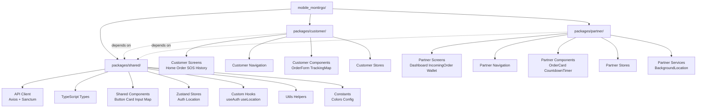
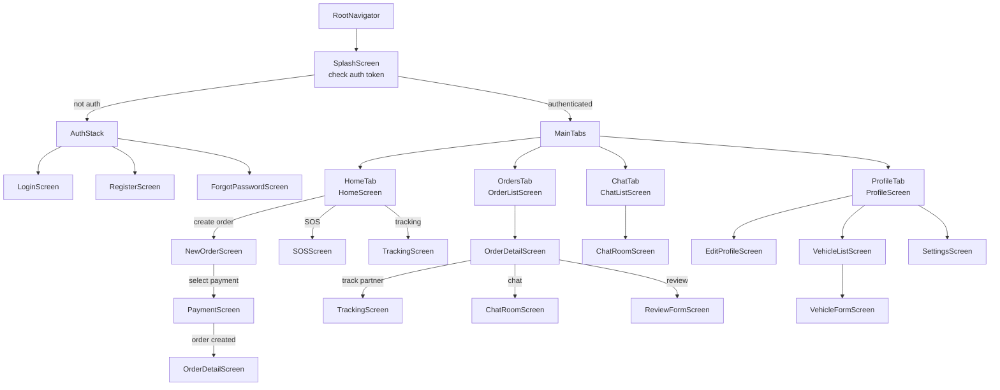
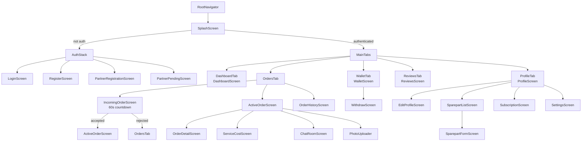
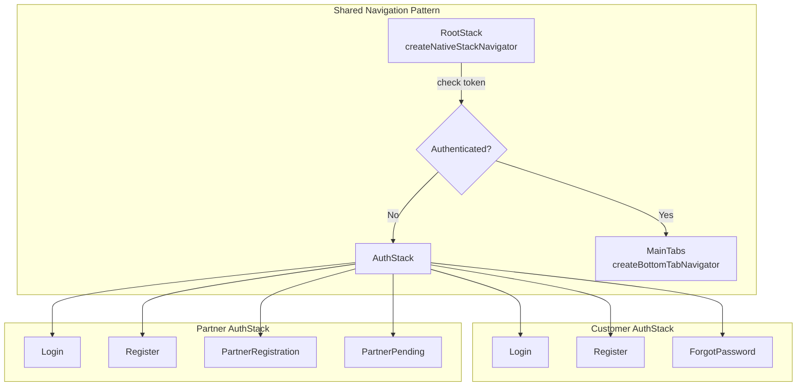
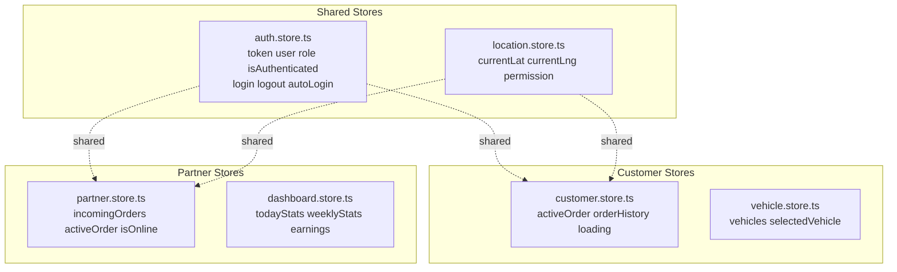
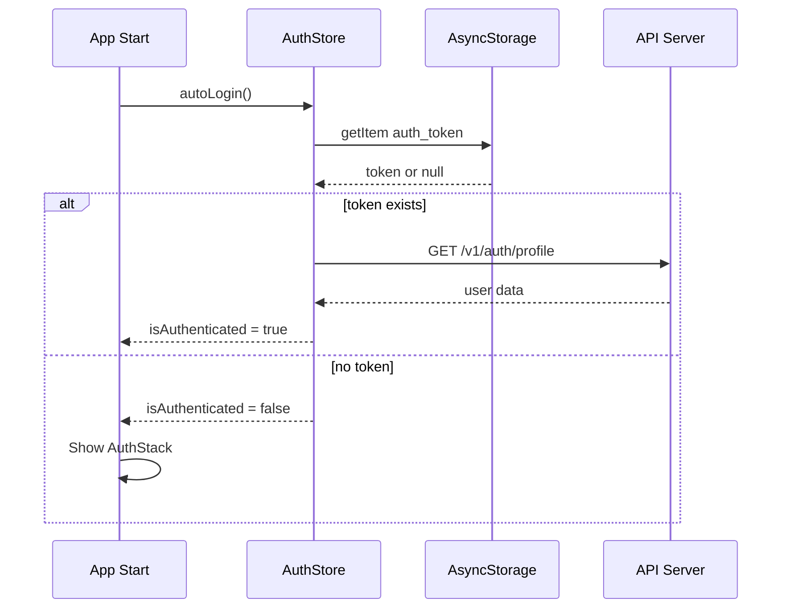
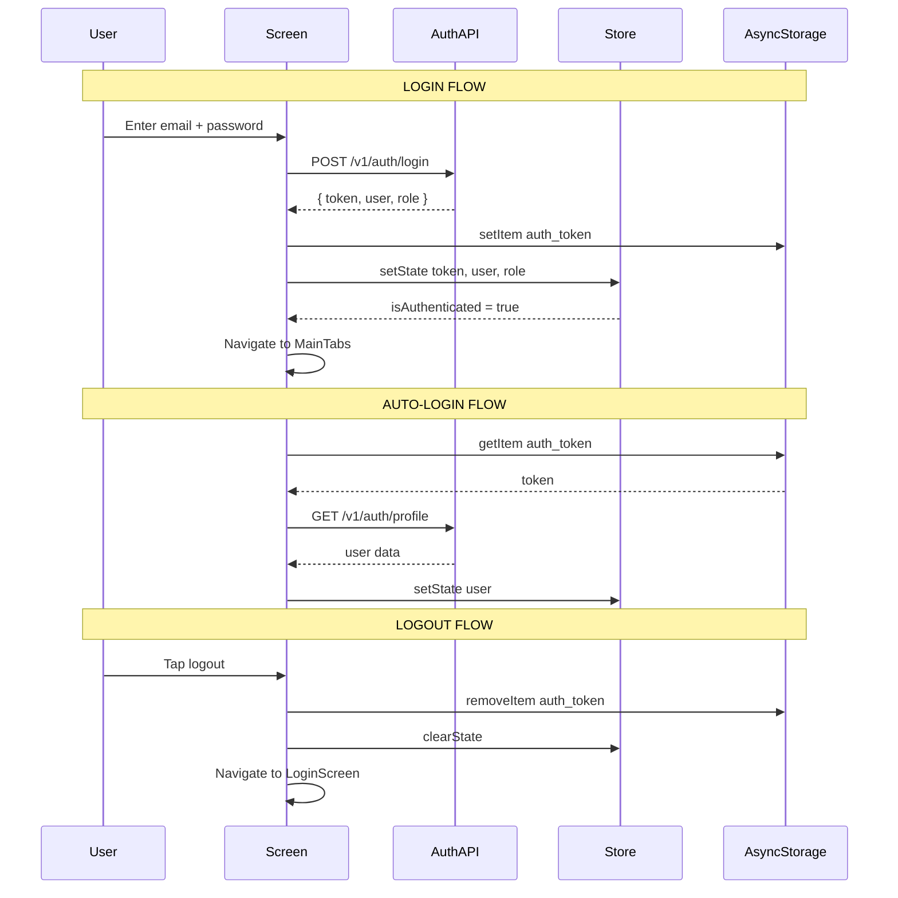
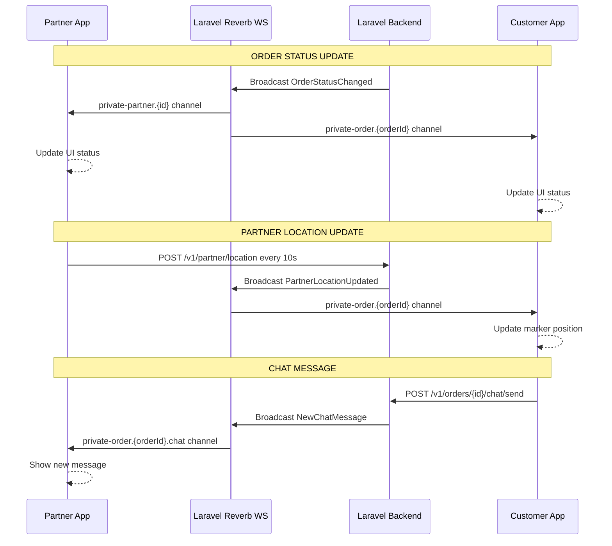
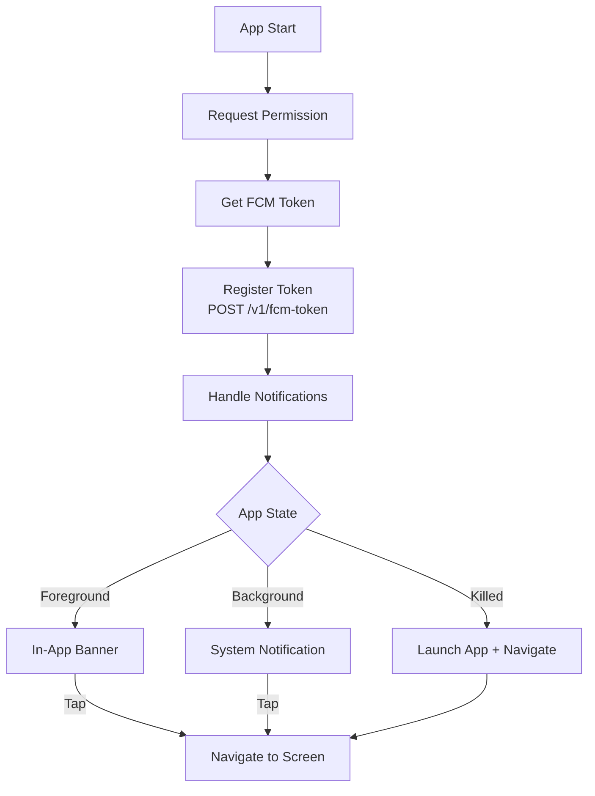
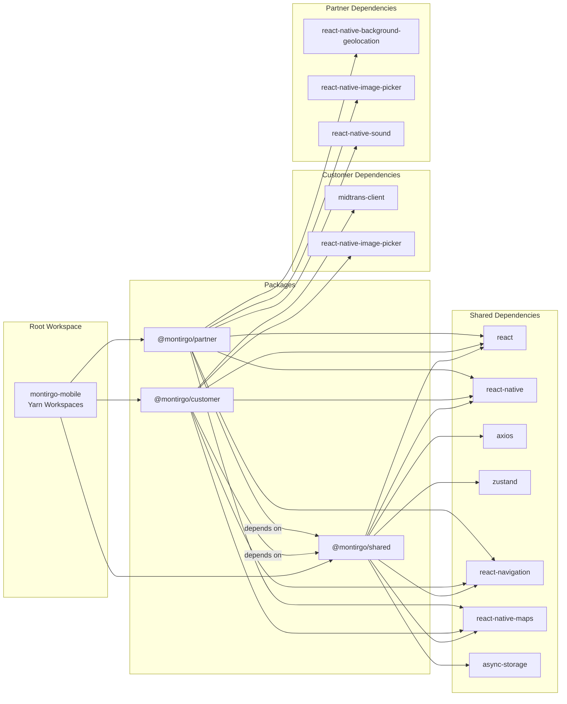

# MontirGo Mobile — Arsitektur & Desain Lengkap

> **Status:** Draft — Menunggu Approval
> **Tanggal:** 16 Juli 2026
> **Referensi:** [`ROADMAP-CUSTOMER-MOBILE.md`](ROADMAP-CUSTOMER-MOBILE.md), [`ROADMAP-PARTNER-MOBILE.md`](ROADMAP-PARTNER-MOBILE.md)

---

## 📋 Daftar Isi

1. [Arsitektur Monorepo](#1-arsitektur-monorepo)
2. [Tech Stack](#2-tech-stack)
3. [Struktur Folder Lengkap](#3-struktur-folder-lengkap)
4. [Shared Package Design](#4-shared-package-design)
5. [Customer App Design](#5-customer-app-design)
6. [Partner App Design](#6-partner-app-design)
7. [Navigation Architecture](#7-navigation-architecture)
8. [State Management](#8-state-management)
9. [API Layer & Auth Flow](#9-api-layer--auth-flow)
10. [Theming & Branding](#10-theming--branding)
11. [Real-time & Background Services](#11-real-time--background-services)
12. [Build & Release Strategy](#12-build--release-strategy)
13. [.gitignore Strategy](#13-gitignore-strategy)
14. [Mapping Fitur ke Shared vs App-Specific](#14-mapping-fitur-ke-shared-vs-app-specific)
15. [Dependency Graph](#15-dependency-graph)

---

## 1. Arsitektur Monorepo

### Mengapa Monorepo?

Customer dan Partner app memiliki **~60-70% kode yang identik** (auth, API client, chat, maps, notifikasi, profile). Dengan monorepo + shared package:

- ✅ Dua app terpisah untuk publish ke App Store / Play Store
- ✅ Code sharing untuk fitur yang sama
- ✅ Maintenance lebih mudah — fix bug di shared package langsung berlaku untuk kedua app
- ✅ Bundle size optimal per app
- ✅ TypeScript type safety lintas package

### High-Level Architecture



### Workspace Configuration

```json
// mobile_montirgo/package.json (root)
{
  "name": "montirgo-mobile",
  "private": true,
  "workspaces": [
    "packages/shared",
    "packages/customer",
    "packages/partner"
  ],
  "scripts": {
    "customer:android": "yarn workspace @montirgo/customer android",
    "customer:ios": "yarn workspace @montirgo/customer ios",
    "partner:android": "yarn workspace @montirgo/partner android",
    "partner:ios": "yarn workspace @montirgo/partner ios",
    "lint": "yarn workspaces foreach run lint",
    "typecheck": "yarn workspaces foreach run typecheck"
  }
}
```

---

## 2. Tech Stack

### Pilihan Teknologi

| Layer | Technology | Versi | Alasan Pemilihan |
|:---|:---|:---|:---|
| **Framework** | React Native (New Architecture) | 0.76+ | Cross-platform, performa baru |
| **Language** | TypeScript | 5.x | Type safety, autocompletion |
| **Meta/Workspace** | Yarn Workspaces | 4.x | Monorepo management |
| **State Management** | Zustand | 5.x | Lightweight, simple API, TypeScript-first |
| **Navigation** | React Navigation | v7 | Standard RN navigation, deep linking |
| **HTTP Client** | Axios | 1.x | Interceptors, error handling |
| **Maps** | react-native-maps | latest | Google Maps provider |
| **Auth Storage** | @react-native-async-storage/async-storage | latest | Token persist |
| **Push Notification** | @react-native-firebase/messaging | latest | FCM integration |
| **Camera/Media** | react-native-image-picker | latest | Upload foto |
| **Real-time** | Laravel Reverb WebSocket | - | Live order updates |
| **UI Components** | NativeWind | 4.x | TailwindCSS for RN, konsisten dengan web |
| **Icons** | react-native-vector-icons | latest | Icon library |
| **Background Location** | react-native-background-geolocation | latest | GPS tracking (Partner only) |
| **Splash Screen** | react-native-bootsplash | latest | Native splash screen |
| **Splash Screen** | react-native-safe-area-context | latest | Safe area handling |

### Mengapa NativeWind?

Karena web project MontirGo menggunakan **Tailwind CSS v3**, menggunakan NativeWind di mobile membuat:
- Design system yang konsisten antara web dan mobile
- Developer yang sudah familiar Tailwind bisa langsung productive
- Utility-first approach mempercepat development UI

### Mengapa Yarn Workspaces (bukan Nx/Turborepo)?

- Lebih ringan dan built-in ke Yarn
- Cukup untuk project dengan 3 packages
- Tidak perlu konfigurasi tambahan yang kompleks
- Mudah di-migrate ke Nx nanti jika dibutuhkan

---

## 3. Struktur Folder Lengkap

### Root Structure

```
mobile_montirgo/
├── .gitignore                          # Git ignore rules
├── .yarnrc.yml                         # Yarn config
├── .prettierrc                         # Code formatter config
├── .eslintrc.js                        # Linting config
├── package.json                        # Root workspace config
├── README.md                           # Mobile project docs
│
├── packages/
│   ├── shared/                         # 📦 Shared Library
│   │   ├── package.json
│   │   ├── tsconfig.json
│   │   ├── index.ts                    # Main export entry
│   │   └── src/
│   │       ├── api/                    # API layer
│   │       ├── types/                  # TypeScript types
│   │       ├── constants/              # Colors, configs
│   │       ├── utils/                  # Helper functions
│   │       ├── hooks/                  # Custom React hooks
│   │       ├── stores/                 # Zustand stores
│   │       ├── components/             # Shared UI components
│   │       └── services/               # Shared services
│   │
│   ├── customer/                       # 📱 Customer App
│   │   ├── package.json
│   │   ├── tsconfig.json
│   │   ├── app.json                    # RN app config
│   │   ├── babel.config.js
│   │   ├── metro.config.js
│   │   ├── tailwind.config.js          # NativeWind config
│   │   ├── android/                    # Android native
│   │   ├── ios/                        # iOS native
│   │   └── src/
│   │       ├── App.tsx                 # Entry point
│   │       ├── screens/                # Screen components
│   │       ├── navigation/             # Navigation config
│   │       ├── components/             # App-specific components
│   │       ├── stores/                 # App-specific stores
│   │       └── assets/                 # Images, fonts, sounds
│   │
│   └── partner/                        # 🔧 Partner App
│       ├── package.json
│       ├── tsconfig.json
│       ├── app.json                    # RN app config
│       ├── babel.config.js
│       ├── metro.config.js
│       ├── tailwind.config.js          # NativeWind config
│       ├── android/                    # Android native
│       ├── ios/                        # iOS native
│       └── src/
│           ├── App.tsx                 # Entry point
│           ├── screens/                # Screen components
│           ├── navigation/             # Navigation config
│           ├── components/             # App-specific components
│           ├── stores/                 # App-specific stores
│           ├── services/               # Background services
│           └── assets/                 # Images, fonts, sounds
```

---

## 4. Shared Package Design

### `packages/shared/src/` Detail Struktur

```
packages/shared/src/
├── api/
│   ├── client.ts                       # Axios instance + interceptors
│   ├── auth.api.ts                     # Login, register, logout
│   ├── order.api.ts                    # CRUD orders
│   ├── partner.api.ts                  # Partner-specific API
│   ├── chat.api.ts                     # Chat messages
│   ├── wallet.api.ts                   # Wallet & transactions
│   ├── notification.api.ts             # FCM token, notification prefs
│   └── types.ts                        # API request/response types
│
├── types/
│   ├── index.ts                        # Re-export all types
│   ├── user.ts                         # User, UserRole
│   ├── partner.ts                      # Partner, Workshop
│   ├── order.ts                        # Order, OrderStatus, OrderItem
│   ├── vehicle.ts                      # Vehicle
│   ├── chat.ts                         # ChatMessage, ChatRoom
│   ├── wallet.ts                       # WalletBalance, Transaction
│   ├── review.ts                       # Review, Rating
│   ├── service-cost.ts                 # ServiceCostItem
│   ├── sos.ts                          # SOSCategory, SOSOrder
│   └── api.ts                          # API response wrappers
│
├── constants/
│   ├── colors.ts                       # Color palette
│   ├── config.ts                       # API base URL, timeouts
│   ├── order-status.ts                 # Status labels, colors, icons
│   ├── sos-categories.ts              # SOS category definitions
│   └── payment-methods.ts             # Payment method options
│
├── utils/
│   ├── formatters.ts                   # Currency, date, phone formatters
│   ├── validators.ts                   # Form validation helpers
│   ├── storage.ts                      # AsyncStorage wrappers
│   ├── location.ts                     # Distance calc, geocoding
│   └── permissions.ts                  # Location, camera permissions
│
├── hooks/
│   ├── useAuth.ts                      # Auth state + login/logout
│   ├── useLocation.ts                  # GPS location hook
│   ├── useOrder.ts                     # Order CRUD operations
│   ├── useRealtime.ts                  # WebSocket/polling hook
│   └── useDebounce.ts                  # Debounce utility hook
│
├── stores/
│   ├── auth.store.ts                   # Auth state + token persist
│   └── location.store.ts              # Current GPS location
│
├── components/
│   ├── ui/
│   │   ├── Button.tsx
│   │   ├── Card.tsx
│   │   ├── Input.tsx
│   │   ├── Badge.tsx
│   │   ├── Avatar.tsx
│   │   ├── Modal.tsx
│   │   ├── LoadingSpinner.tsx
│   │   ├── EmptyState.tsx
│   │   └── ErrorBoundary.tsx
│   ├── maps/
│   │   ├── MapView.tsx                 # Reusable map component
│   │   ├── Marker.tsx                  # Custom markers
│   │   └── RouteLine.tsx              # Polyline route
│   └── order/
│       ├── StatusBadge.tsx             # Colored status badge
│       └── OrderCard.tsx               # Order list item card
│
└── services/
    ├── api.service.ts                  # API service orchestrator
    └── storage.service.ts             # AsyncStorage service
```

### Shared Package Exports

```typescript
// packages/shared/index.ts
// API
export { apiClient } from './src/api/client';
export * from './src/api/auth.api';
export * from './src/api/order.api';
export * from './src/api/chat.api';
export * from './src/api/wallet.api';
export * from './src/api/notification.api';

// Types
export * from './src/types';

// Constants
export { COLORS } from './src/constants/colors';
export { ORDER_STATUS_CONFIG } from './src/constants/order-status';
export { SOS_CATEGORIES } from './src/constants/sos-categories';

// Utils
export { formatCurrency, formatDate } from './src/utils/formatters';
export { calculateDistance } from './src/utils/location';

// Hooks
export { useAuth } from './src/hooks/useAuth';
export { useLocation } from './src/hooks/useLocation';

// Stores
export { useAuthStore } from './src/stores/auth.store';
export { useLocationStore } from './src/stores/location.store';

// Components
export { Button } from './src/components/ui/Button';
export { Card } from './src/components/ui/Card';
export { StatusBadge } from './src/components/order/StatusBadge';
```

### `package.json` Shared

```json
{
  "name": "@montirgo/shared",
  "version": "1.0.0",
  "private": true,
  "main": "index.ts",
  "types": "index.ts",
  "peerDependencies": {
    "react": "^18.0.0",
    "react-native": "^0.76.0",
    "axios": "^1.7.0",
    "zustand": "^5.0.0",
    "react-native-maps": "^1.0.0",
    "@react-native-async-storage/async-storage": "^2.0.0"
  }
}
```

---

## 5. Customer App Design

### `packages/customer/src/` Detail Struktur

```
packages/customer/src/
├── App.tsx                             # Root component + providers
│
├── navigation/
│   ├── index.tsx                       # Root navigator
│   ├── AuthStack.tsx                   # Unauthenticated screens
│   └── MainTabs.tsx                    # Authenticated bottom tabs
│
├── screens/
│   ├── auth/
│   │   ├── LoginScreen.tsx
│   │   ├── RegisterScreen.tsx
│   │   └── ForgotPasswordScreen.tsx
│   ├── home/
│   │   └── HomeScreen.tsx              # Quick actions + nearby partners
│   ├── order/
│   │   ├── NewOrderScreen.tsx          # Create order form
│   │   ├── OrderDetailScreen.tsx       # Order status + partner info
│   │   ├── OrderListScreen.tsx         # History with tabs
│   │   └── PaymentScreen.tsx           # Payment method selection
│   ├── tracking/
│   │   └── TrackingScreen.tsx          # Live partner tracking on map
│   ├── chat/
│   │   ├── ChatListScreen.tsx          # Active conversations
│   │   └── ChatRoomScreen.tsx          # Message thread
│   ├── sos/
│   │   └── SOSScreen.tsx              # Emergency order
│   ├── history/
│   │   └── OrderHistoryScreen.tsx      # Past orders
│   ├── review/
│   │   ├── ReviewFormScreen.tsx        # Write review
│   │   └── ReviewListScreen.tsx        # Past reviews
│   └── profile/
│       ├── ProfileScreen.tsx           # View profile
│       ├── EditProfileScreen.tsx       # Edit name, phone, avatar
│       ├── VehicleListScreen.tsx       # Manage vehicles
│       ├── VehicleFormScreen.tsx       # Add/edit vehicle
│       └── SettingsScreen.tsx          # App settings
│
├── components/
│   ├── OrderForm.tsx                   # New order form component
│   ├── PartnerCard.tsx                 # Partner info card
│   ├── TrackingMap.tsx                 # Live tracking map
│   ├── SOSButton.tsx                   # Floating SOS button
│   ├── QuickActions.tsx                # Home screen quick actions
│   └── VehiclePicker.tsx              # Vehicle selection component
│
├── stores/
│   └── customer.store.ts              # Customer-specific state
│
└── assets/
    ├── images/
    │   ├── logo-splash.png             # Splash screen logo
    │   ├── onboarding-1.png
    │   ├── onboarding-2.png
    │   └── onboarding-3.png
    ├── sounds/
    │   └── notification.mp3
    └── fonts/
        └── Inter-*.ttf
```

### Navigation Structure Customer



### Customer-Specific Features

| Feature | Detail |
|:---|:---|
| **SOS Button** | Floating red button, 5 kategori darurat, priority dispatch |
| **Vehicle Management** | CRUD kendaraan (brand, model, plate, type) |
| **Payment Integration** | Midtrans Snap SDK (QRIS, Card, E-Wallet, VA) |
| **Order Creation** | Auto GPS, vehicle picker, service type, problem desc |
| **Live Tracking** | Real-time partner position di map |
| **Review System** | Star rating + text comment setelah order selesai |

---

## 6. Partner App Design

### `packages/partner/src/` Detail Struktur

```
packages/partner/src/
├── App.tsx                             # Root component + providers
│
├── navigation/
│   ├── index.tsx                       # Root navigator
│   ├── AuthStack.tsx                   # Unauthenticated screens
│   └── MainTabs.tsx                    # Authenticated bottom tabs
│
├── screens/
│   ├── auth/
│   │   ├── LoginScreen.tsx
│   │   ├── RegisterScreen.tsx
│   │   ├── PartnerRegistrationScreen.tsx  # Workshop details
│   │   └── PartnerPendingScreen.tsx       # Awaiting verification
│   ├── dashboard/
│   │   └── DashboardScreen.tsx         # Online toggle + stats + map
│   ├── order/
│   │   ├── IncomingOrderScreen.tsx     # Full-screen accept/reject
│   │   ├── ActiveOrderScreen.tsx       # Current order management
│   │   ├── OrderHistoryScreen.tsx      # Past orders
│   │   └── OrderDetailScreen.tsx       # Order details
│   ├── chat/
│   │   ├── ChatListScreen.tsx
│   │   └── ChatRoomScreen.tsx          # With quick replies
│   ├── service-cost/
│   │   └── ServiceCostScreen.tsx       # Input biaya servis
│   ├── wallet/
│   │   ├── WalletScreen.tsx            # Saldo + riwayat
│   │   └── WithdrawScreen.tsx          # Form penarikan
│   ├── reviews/
│   │   └── ReviewsScreen.tsx           # Lihat rating & review
│   ├── sparepart/
│   │   ├── SparepartListScreen.tsx     # Manajemen sparepart
│   │   └── SparepartFormScreen.tsx     # Tambah/edit sparepart
│   ├── subscription/
│   │   └── SubscriptionScreen.tsx      # Paket langganan
│   └── profile/
│       ├── ProfileScreen.tsx           # Workshop info
│       ├── EditProfileScreen.tsx
│       └── SettingsScreen.tsx
│
├── components/
│   ├── IncomingOrderModal.tsx          # Full-screen order alert
│   ├── CountdownTimer.tsx             # 60s circular timer
│   ├── OnlineToggle.tsx               # Online/offline switch
│   ├── StatsCard.tsx                   # Dashboard stats
│   ├── OrderTimeline.tsx              # Status timeline
│   ├── CostItemRow.tsx                # Service cost item row
│   ├── PhotoUploader.tsx              # Camera/gallery picker
│   └── QuickReplies.tsx               # Chat quick reply buttons
│
├── stores/
│   ├── partner.store.ts               # Partner-specific state
│   └── order.store.ts                 # Active order state
│
├── services/
│   └── background-location.service.ts  # Background GPS tracking
│
└── assets/
    ├── images/
    │   ├── logo-splash.png
    │   └── partner-onboarding.png
    ├── sounds/
    │   ├── incoming-order.mp3          # Order masuk alert
    │   └── timer-warning.mp3           # 10s warning sound
    └── fonts/
        └── Inter-*.ttf
```

### Navigation Structure Partner



### Partner-Specific Features

| Feature | Detail |
|:---|:---|
| **Incoming Order Alert** | Full-screen modal + alarm sound + 60s countdown + auto-reject |
| **Online/Offline Toggle** | Switch untuk aktif/nonaktif menerima order |
| **Background Location** | GPS tracking setiap 10 detik saat order aktif |
| **Service Cost Input** | Dynamic form: tambah/hapus item service + sparepart |
| **Photo Upload** | Before/after photos dengan camera/gallery picker |
| **Wallet & Withdraw** | Saldo, riwayat transaksi, penarikan ke bank |
| **Quick Replies** | Template pesan cepat untuk chat |
| **Navigation Integration** | Deep link ke Google Maps / Waze |

---

## 7. Navigation Architecture

### Shared Navigation Pattern



### Tab Configuration

**Customer Tabs:**
| Tab | Icon | Screen | Badge |
|:---|:---|:---|:---|
| Home | 🏠 | HomeScreen | - |
| Orders | 📋 | OrderListScreen | Active orders count |
| Chat | 💬 | ChatListScreen | Unread messages |
| Profile | 👤 | ProfileScreen | - |

**Partner Tabs:**
| Tab | Icon | Screen | Badge |
|:---|:---|:---|:---|
| Dashboard | 📊 | DashboardScreen | - |
| Orders | 📋 | OrdersTab | Incoming orders count |
| Wallet | 💰 | WalletScreen | - |
| Reviews | ⭐ | ReviewsScreen | - |
| Profile | 👤 | ProfileScreen | - |

### Deep Linking Configuration

```typescript
// Shared deep link config
const linking = {
  prefixes: ['montirgo://', 'https://montirgo.test'],
  config: {
    screens: {
      // Customer deep links
      OrderDetail: 'order/:id',
      Tracking: 'order/:id/tracking',
      ChatRoom: 'chat/:orderId',
      ReviewForm: 'review/:orderId',
      
      // Partner deep links
      IncomingOrder: 'partner/order/:id/incoming',
      ActiveOrder: 'partner/order/:id/active',
      ServiceCost: 'partner/order/:id/service-cost',
    },
  },
};
```

---

## 8. State Management

### Zustand Store Architecture



### Auth Store (Shared)

```typescript
// packages/shared/src/stores/auth.store.ts
interface AuthState {
  token: string | null;
  user: User | null;
  role: UserRole | null;
  isAuthenticated: boolean;
  isLoading: boolean;
  
  // Actions
  login: (email: string, password: string) => Promise<void>;
  register: (data: RegisterData) => Promise<void>;
  logout: () => Promise<void>;
  autoLogin: () => Promise<boolean>;
  updateProfile: (data: Partial<User>) => Promise<void>;
}
```

### Token Persistence Flow



---

## 9. API Layer & Auth Flow

### API Client Configuration

```typescript
// packages/shared/src/api/client.ts
import axios from 'axios';
import AsyncStorage from '@react-native-async-storage/async-storage';

const apiClient = axios.create({
  baseURL: 'https://montirgo.test/api/v1',
  timeout: 15000,
  headers: {
    'Accept': 'application/json',
    'Content-Type': 'application/json',
  },
});

// Request interceptor — attach token
apiClient.interceptors.request.use(async (config) => {
  const token = await AsyncStorage.getItem('auth_token');
  if (token) {
    config.headers.Authorization = `Bearer ${token}`;
  }
  return config;
});

// Response interceptor — handle errors
apiClient.interceptors.response.use(
  (response) => response,
  async (error) => {
    if (error.response?.status === 401) {
      await AsyncStorage.removeItem('auth_token');
      // Redirect to login via navigation service
    }
    return Promise.reject(error);
  }
);
```

### Auth Flow Diagram



### API Endpoint Mapping

| Module | Customer API | Partner API |
|:---|:---|:---|
| **Auth** | `POST /v1/auth/login` | `POST /v1/auth/login` |
| **Auth** | `POST /v1/auth/register` | `POST /v1/auth/register` |
| **Profile** | `GET /v1/auth/profile` | `GET /v1/partner/profile` |
| **Profile** | `PATCH /v1/auth/profile` | `PATCH /v1/partner/profile` |
| **Orders** | `POST /v1/orders` | `GET /v1/orders?status=` |
| **Orders** | `GET /v1/orders/{id}` | `PATCH /v1/partner/orders/{id}/accept` |
| **Orders** | `PATCH /v1/orders/{id}/cancel` | `PATCH /v1/partner/orders/{id}/reject` |
| **Orders** | - | `PATCH /v1/partner/orders/{id}/status` |
| **Tracking** | `GET /v1/orders/{id}/track` | `POST /v1/partner/location` |
| **Chat** | `GET /v1/orders/{id}/chat` | `GET /v1/orders/{id}/chat` |
| **Chat** | `POST /v1/orders/{id}/chat/send` | `POST /v1/orders/{id}/chat/send` |
| **Wallet** | `GET /v1/wallet` | `GET /v1/wallet` |
| **Wallet** | - | `POST /v1/wallet/withdraw` |
| **Service Cost** | `GET /v1/orders/{id}/service-cost` | `POST /v1/orders/{id}/service-cost` |
| **SOS** | `POST /v1/sos` | - |
| **Photos** | `GET /v1/orders/{id}/photos` | `POST /v1/orders/{id}/photos` |
| **Reviews** | `POST /v1/orders/{id}/review` | `GET /v1/partner/reviews` |
| **Notification** | `POST /v1/fcm-token` | `POST /v1/fcm-token` |

---

## 10. Theming & Branding

### Color Palette

```typescript
// packages/shared/src/constants/colors.ts
export const COLORS = {
  // Brand Colors
  primary: '#FF6B00',           // Orange — brand MontirGo
  primaryDark: '#E55A00',
  primaryLight: '#FF8C33',
  
  // Customer Theme
  customer: {
    primary: '#FF6B00',         // Orange
    secondary: '#1E3A5F',       // Dark Blue
    accent: '#FFB347',          // Light Orange
    background: '#FFFFFF',
    surface: '#F8F9FA',
  },
  
  // Partner Theme
  partner: {
    primary: '#0D9488',         // Teal
    secondary: '#1E3A5F',       // Dark Blue
    accent: '#5EEAD4',          // Light Teal
    background: '#FFFFFF',
    surface: '#F0FDFA',
  },
  
  // Neutral
  white: '#FFFFFF',
  black: '#1A1A1A',
  gray: {
    50: '#F9FAFB',
    100: '#F3F4F6',
    200: '#E5E7EB',
    300: '#D1D5DB',
    400: '#9CA3AF',
    500: '#6B7280',
    600: '#4B5563',
    700: '#374151',
    800: '#1F2937',
    900: '#111827',
  },
  
  // Status Colors
  success: '#10B981',
  warning: '#F59E0B',
  error: '#EF4444',
  info: '#3B82F6',
  
  // Order Status Colors
  orderStatus: {
    pending: '#FCD34D',
    dispatching: '#FB923C',
    accepted: '#60A5FA',
    on_the_way: '#818CF8',
    arrived: '#C084FC',
    in_progress: '#FB923C',
    completed: '#34D399',
    cancelled: '#9CA3AF',
  },
} as const;
```

### App Icons (Differentiation)

| App | Icon | Splash Screen |
|:---|:---|:---|
| **Customer** | Logo + Orange background (`#FF6B00`) | Logo centered + Orange gradient |
| **Partner** | Logo + Teal background (`#0D9488`) | Logo centered + Teal gradient |

### Typography Scale

```typescript
// packages/shared/src/constants/typography.ts
export const TYPOGRAPHY = {
  h1: { fontSize: 28, fontWeight: '700' as const, lineHeight: 36 },
  h2: { fontSize: 24, fontWeight: '700' as const, lineHeight: 32 },
  h3: { fontSize: 20, fontWeight: '600' as const, lineHeight: 28 },
  h4: { fontSize: 18, fontWeight: '600' as const, lineHeight: 24 },
  body: { fontSize: 16, fontWeight: '400' as const, lineHeight: 24 },
  bodySmall: { fontSize: 14, fontWeight: '400' as const, lineHeight: 20 },
  caption: { fontSize: 12, fontWeight: '400' as const, lineHeight: 16 },
  button: { fontSize: 16, fontWeight: '600' as const, lineHeight: 24 },
};
```

---

## 11. Real-time & Background Services

### WebSocket Architecture



### Background Location (Partner Only)

```typescript
// packages/partner/src/services/background-location.service.ts
// Active only when order status: on_the_way or in_progress
// Updates location to server every 10 seconds
// Stops when order completed/cancelled
```

### Push Notification Flow



---

## 12. Build & Release Strategy

### App Configuration

| Config | Customer App | Partner App |
|:---|:---|:---|
| **Package Name (Android)** | `com.montirgo.customer` | `com.montirgo.partner` |
| **Bundle ID (iOS)** | `com.montirgo.customer` | `com.montirgo.partner` |
| **App Name (Android)** | MontirGo | MontirGo Partner |
| **App Name (iOS)** | MontirGo - Bengkel Online | MontirGo Partner |
| **Version** | 1.0.0 | 1.0.0 |
| **Min SDK (Android)** | 24 (Android 7.0) | 24 (Android 7.0) |
| **Target SDK (Android)** | 34 | 34 |
| **Min iOS** | 15.1 | 15.1 |

### Build Scripts

```json
// Root package.json scripts
{
  "scripts": {
    "customer:android:dev": "cd packages/customer && react-native run-android --variant=debug",
    "customer:android:release": "cd packages/customer && react-native run-android --variant=release",
    "customer:ios:dev": "cd packages/customer && react-native run-ios",
    "customer:android:build": "cd packages/customer/android && ./gradlew assembleRelease",
    "partner:android:dev": "cd packages/partner && react-native run-android --variant=debug",
    "partner:android:release": "cd packages/partner && react-native run-android --variant=release",
    "partner:ios:dev": "cd packages/partner && react-native run-ios",
    "partner:android:build": "cd packages/partner/android && ./gradlew assembleRelease"
  }
}
```

### Environment Configuration

```typescript
// Environment config per app
const ENV = {
  development: {
    apiUrl: 'https://montirgo.test/api/v1',
    wsUrl: 'wss://montirgo.test',
  },
  staging: {
    apiUrl: 'https://staging.montirgo.com/api/v1',
    wsUrl: 'wss://staging.montirgo.com',
  },
  production: {
    apiUrl: 'https://montirgo.com/api/v1',
    wsUrl: 'wss://montirgo.com',
  },
};
```

---

## 13. .gitignore Strategy

### Opsi: Ignore Seluruh Folder Mobile

Karena `mobile_montirgo/` adalah project React Native yang memiliki `node_modules/`, `android/build/`, `ios/build/`, dan file biner lainnya yang sangat besar, **disarankan untuk mengabaikan seluruh folder** dari Git.

```gitignore
# ============================================================
# MOBILE PROJECT — DO NOT COMMIT TO GIT
# ============================================================
# Alasan:
# 1. React Native project memiliki banyak file biner (android/, ios/)
# 2. node_modules/ sangat besar dan redundant
# 3. Build artifacts (apk, ipa) tidak perlu di-version control
# 4. Project mobile dikelola secara terpisah dari backend Laravel
# ============================================================
/mobile_montirgo/
```

### Opsi Alternatif: Selective Ignore

Jika ingin beberapa file tetap di-commit (misal README, .gitignore itu sendiri):

```gitignore
# Mobile project build artifacts
mobile_montirgo/node_modules/
mobile_montirgo/packages/*/node_modules/
mobile_montirgo/packages/*/android/
mobile_montirgo/packages/*/ios/
mobile_montirgo/packages/*/android/app/build/
mobile_montirgo/.expo/
mobile_montirgo/.yarn/
mobile_montirgo/yarn.lock

# Environment & secrets
mobile_montirgo/.env
mobile_montirgo/.env.local
mobile_montirgo/**/.env
```

### Rekomendasi

**Gunakan Opsi 1 (Ignore Seluruh Folder)** karena:
1. File `yarn.lock` dan `package.json` bisa di-generate ulang
2. React Native native files (`android/`, `ios/`) sangat besar
3. Backend developer tidak perlu file mobile di repo
4. Mobile team bisa menggunakan repo terpisah atau Git subtree

---

## 14. Mapping Fitur ke Shared vs App-Specific

### Fitur yang Dapat di-Share

| Fitur | Shared Package | Alasan |
|:---|:---|:---|
| ✅ API Client + Interceptors | `shared/api/client.ts` | Identik untuk kedua app |
| ✅ TypeScript Types | `shared/types/` | Tipe data sama |
| ✅ Auth Store + Hooks | `shared/stores/auth.store.ts` | Login/register flow sama |
| ✅ Location Store + Hook | `shared/stores/location.store.ts` | GPS tracking sama |
| ✅ Formatters & Validators | `shared/utils/` | Utility functions sama |
| ✅ UI Components | `shared/components/ui/` | Button, Card, Input sama |
| ✅ Map Components | `shared/components/maps/` | MapView, Marker sama |
| ✅ Status Badge | `shared/components/order/StatusBadge.tsx` | Status display sama |
| ✅ Constants | `shared/constants/` | Colors, configs sama |
| ✅ Chat API | `shared/api/chat.api.ts` | Chat API sama |
| ✅ Notification API | `shared/api/notification.api.ts` | FCM setup sama |

### Fitur yang App-Specific

| Fitur | App | Detail |
|:---|:---|:---|
| 📱 SOS Button | Customer | Floating emergency button |
| 📱 Vehicle Management | Customer | CRUD kendaraan |
| 📱 Payment Integration | Customer | Midtrans Snap SDK |
| 📱 Order Creation Form | Customer | Buat order baru |
| 📱 Live Tracking Screen | Customer | Track partner di map |
| 📱 Review Form | Customer | Tulis review |
| 🔧 Dashboard Screen | Partner | Stats + online toggle |
| 🔧 Incoming Order Modal | Partner | 60s countdown accept/reject |
| 🔧 Active Order Management | Partner | Status navigation flow |
| 🔧 Background Location Service | Partner | GPS tracking 10s interval |
| 🔧 Service Cost Form | Partner | Input biaya servis |
| 🔧 Photo Upload | Partner | Before/after photos |
| 🔧 Wallet & Withdraw | Partner | Saldo + penarikan |
| 🔧 Quick Replies | Partner | Chat template pesan |
| 🔧 Sparepart Management | Partner | CRUD sparepart |

---

## 15. Dependency Graph

### Package Dependencies



---

## 📊 Ringkasan

| Aspek | Keputusan |
|:---|:---|
| **Arsitektur** | Monorepo dengan Yarn Workspaces |
| **Framework** | React Native 0.76+ (New Architecture) |
| **Language** | TypeScript 5.x |
| **State** | Zustand 5.x |
| **UI** | NativeWind 4.x (TailwindCSS for RN) |
| **Navigation** | React Navigation v7 |
| **Apps** | 2 app terpisah (Customer + Partner) |
| **Shared Code** | ~60-70% via @montirgo/shared |
| **Base URL** | `https://montirgo.test/api/v1` |
| **Bundle ID** | `com.montirgo.customer` / `com.montirgo.partner` |
| **Git Strategy** | Ignore seluruh `mobile_montirgo/` folder |
| **Customer Theme** | Orange (#FF6B00) dominant |
| **Partner Theme** | Teal (#0D9488) dominant |

---

> **Last Updated:** 16 Juli 2026
> **Status:** Draft — Menunggu Approval untuk Implementasi
