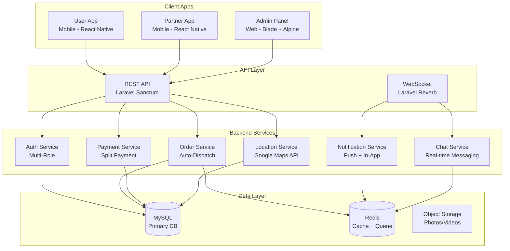
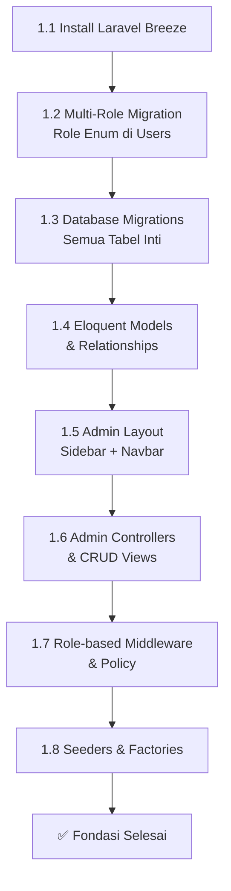
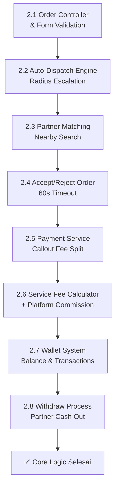
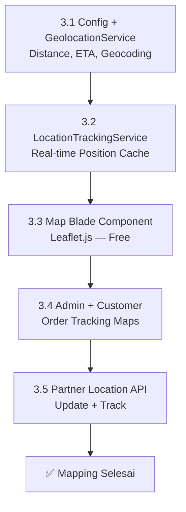
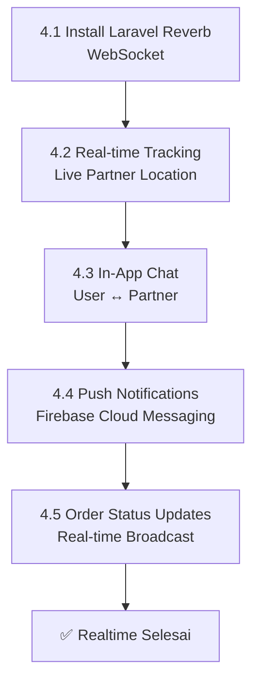
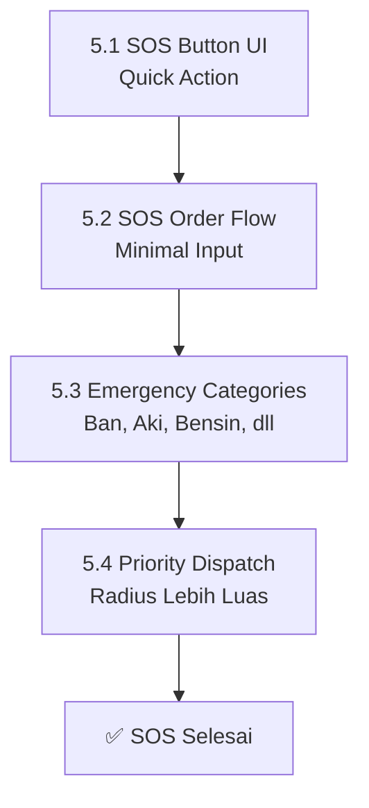
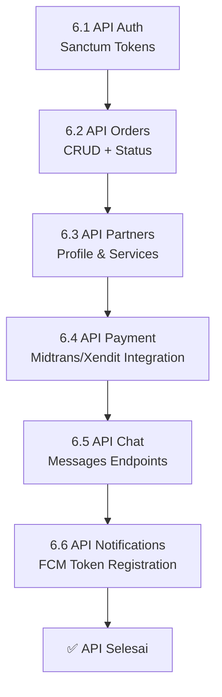
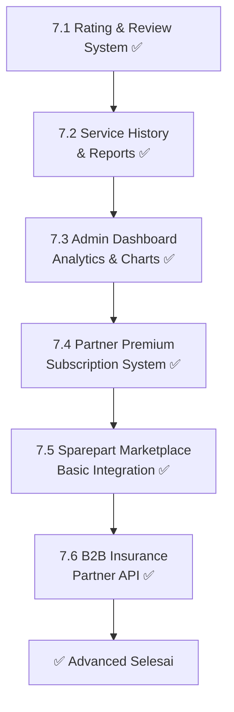
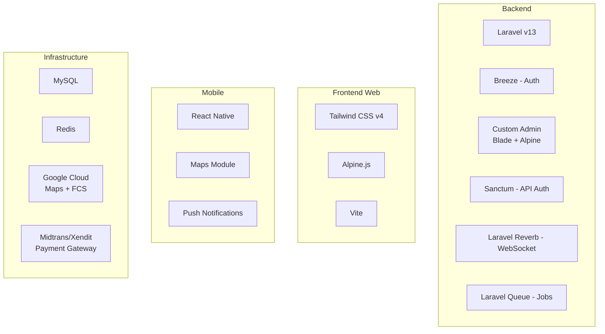
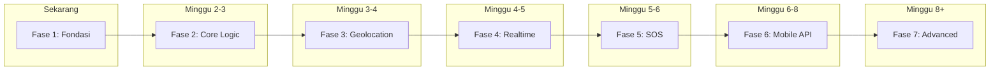

# MontirGo — Roadmap Pengembangan Lengkap

> Dokumen ini berisi rencana pengembangan lengkap untuk aplikasi MontirGo,
> dari fondasi hingga fitur-fitur canggih.

---

## 📊 Status Proyek Saat Ini

| Item | Status |
|:---|:---|
| Framework | Laravel v13 ✅ |
| PHP | 8.5 ✅ |
| Database | MySQL (montirgo) ✅ |
| Cache/Session/Queue | Redis ✅ |
| Frontend | Tailwind CSS v4 ✅ |
| Testing | Pest v4 ✅ |
| Auth System | ✅ Laravel Breeze (Blade + Alpine) |
| Admin Panel | ✅ Custom (Blade + Alpine) |
| Models & Migrations | ✅ 18 models + 18 migrations |
| Landing Page | ✅ Responsive with branding |
| Customer Dashboard | ✅ Stats, orders, wallet, vehicles |
| Partner Dashboard | ✅ Earnings, orders, services |
| Role-Based Routing | ✅ RoleMiddleware + redirect |
| Factories & Seeders | ✅ User, Partner, Vehicle, Order |
| **FASE 1** | **✅ Selesai** |
| **FASE 2** | **✅ Selesai** |
| **FASE 3** | **✅ Selesai** |
| **FASE 4** | **✅ Selesai** |
| **FASE 5** | **✅ Selesai** |
| **FASE 6** | **✅ Selesai** |
| **FASE 7** | **✅ Selesai** |

---

## 🏗️ Arsitektur Sistem



---

## 🗃️ Database Schema

### ERD — Struktur Tabel Utama

```mermaid
erDiagram
    users {
        bigint id PK
        string name
        string email UK
        string password
        string phone
        enum role "customer,partner,admin"
        timestamp email_verified_at
        timestamp created_at
        timestamp updated_at
    }

    partners {
        bigint id PK
        bigint user_id FK
        string shop_name
        string address
        decimal latitude
        decimal longitude
        string phone
        string description
        string ktp_number
        string ktp_photo
        string business_license
        enum status "pending,active,suspended"
        boolean is_online
        decimal rating_avg
        int total_reviews
        timestamp created_at
        timestamp updated_at
    }

    partner_services {
        bigint id PK
        bigint partner_id FK
        string name
        text description
        decimal base_price
        enum category "towing,repair,ac,maintenance,others"
        boolean is_active
        timestamp created_at
        timestamp updated_at
    }

    vehicles {
        bigint id PK
        bigint user_id FK
        enum type "motor,mobil"
        string brand
        string model
        int year
        string plate_number
        string color
        timestamp created_at
        timestamp updated_at
    }

    orders {
        bigint id PK
        string code UK
        bigint user_id FK
        bigint partner_id FK
        bigint vehicle_id FK
        bigint service_id FK
        enum type "normal,sos"
        enum sos_type nullable "flat_tire,dead_battery,out_of_fuel,locked_keys,overheat"
        text description
        decimal latitude
        decimal longitude
        text address
        enum status "searching,accepted,en_route,arriving,in_progress,completed,cancelled"
        decimal callout_fee
        decimal service_fee
        decimal platform_commission
        decimal partner_earning
        enum payment_method nullable "cash,qris,bank_transfer,wallet"
        enum payment_status "pending,paid,refunded"
        int radius_km
        timestamp accepted_at
        timestamp arrived_at
        timestamp completed_at
        timestamp cancelled_at
        timestamp created_at
        timestamp updated_at
    }

    order_photos {
        bigint id PK
        bigint order_id FK
        string photo_path
        enum type "before,after,complaint"
        timestamp created_at
    }

    reviews {
        bigint id PK
        bigint order_id FK
        bigint user_id FK
        bigint partner_id FK
        int rating "1-5"
        text comment
        timestamp created_at
    }

    chats {
        bigint id PK
        bigint order_id FK
        timestamp created_at
    }

    chat_messages {
        bigint id PK
        bigint chat_id FK
        bigint sender_id FK
        text message
        string file_path nullable
        boolean is_read
        timestamp created_at
    }

    payments {
        bigint id PK
        bigint order_id FK
        decimal amount
        enum method "cash,qris,bank_transfer,wallet"
        enum status "pending,paid,refunded"
        string reference_number nullable
        json metadata nullable
        timestamp paid_at
        timestamp created_at
    }

    wallet_balances {
        bigint id PK
        bigint user_id FK
        decimal balance
        decimal pending_balance
        timestamp updated_at
    }

    wallet_transactions {
        bigint id PK
        bigint wallet_id FK
        bigint related_order_id FK nullable
        enum type "credit,debit,withdraw"
        decimal amount
        text description
        enum status "pending,completed,failed"
        timestamp created_at
    }

    withdraw_requests {
        bigint id PK
        bigint user_id FK
        decimal amount
        string bank_name
        string bank_account_number
        string bank_account_name
        enum status "pending,approved,rejected,paid"
        text admin_notes nullable
        timestamp processed_at
        timestamp created_at
        timestamp updated_at
    }

    notifications_log {
        bigint id PK
        bigint user_id FK
        string title
        text body
        json data nullable
        enum channel "push,in_app,sms"
        boolean is_read
        timestamp created_at
    }

    users ||--o{ vehicles : "has"
    users ||--o{ orders : "creates"
    users ||--o{ reviews : "writes"
    users ||--o| wallet_balances : "has"
    users ||--o{ withdraw_requests : "requests"
    partners ||--o{ partner_services : "offers"
    partners ||--o{ orders : "accepts"
    partners ||--o{ reviews : "receives"
    orders ||--o{ order_photos : "has"
    orders ||--o{ reviews : "has"
    orders ||--o{ payments : "has"
    orders ||--o| chats : "has"
    chats ||--o{ chat_messages : "contains"
    wallet_balances ||--o{ wallet_transactions : "records"
```

---

## 🔄 Alur Pengembangan per Fase

### FASE 1 — Fondasi (Auth + Schema + Admin)



**Detail Tasks:**

| ID | Task | Output |
|:---|:---|:---|
| 1.1 | Install Breeze (Blade + Alpine) | Login, Register, Forgot Password |
| 1.2 | Tambah kolom `role` enum ke users table | `customer`, `partner`, `admin` |
| 1.3 | Buat migrations: partners, vehicles, orders, payments, reviews, chats, wallets, dll | Semua tabel tercipta |
| 1.4 | Buat Eloquent Models + Relationships | Model: User, Partner, Order, Vehicle, dll |
| 1.5 | Buat Admin Layout (Sidebar + Navbar + Components) | Layout base untuk admin panel |
| 1.6 | Buat Admin Controllers + CRUD Views | User Management, Partner Management, Order Monitoring |
| 1.7 | Buat Role Middleware + Policy | Akses terkontrol per role |
| 1.8 | Buat Factories & Seeders | Data dummy untuk testing |

---

### FASE 2 — Core Business Logic (Order + Dispatch + Payment)



**Detail Tasks:**

| ID | Task | Output |
|:---|:---|:---|
| 2.1 | Order Controller + Validasi Form | Buat order dengan validasi lengkap |
| 2.2 | Auto-Dispatch Engine | Radius escalation 5km → 10km → ... → 30km |
| 2.3 | Partner Matching (Haversine Formula) | Cari bengkel terdekat berdasarkan GPS |
| 2.4 | Accept/Reject + 60s Timeout | Queue job untuk timeout handling |
| 2.5 | Payment Service (Callout Fee) | Split 80% partner / 20% platform |
| 2.6 | Service Fee Calculator | Komisi tambahan 5-10% untuk nontunai |
| 2.7 | Wallet System | Saldo, transaksi, histori |
| 2.8 | Withdraw Process | Pengajuan → Approval → Transfer |

---

### FASE 3 — Geolocation & Mapping ✅ Selesai



**Detail Tasks:**

| ID | Task | Output | Status |
|:---|:---|:---|:---|
| 3.1 | Config Maps + GeolocationService | Distance, ETA, reverse geocoding (OSM/Google) | ✅ |
| 3.2 | LocationTrackingService | Real-time position cache, partner/customer tracking | ✅ |
| 3.3 | Map Blade Component | Leaflet.js interactive map, markers, read-only mode | ✅ |
| 3.4 | Admin + Customer Map Views | Order location map, tracking map dengan distance/ETA | ✅ |
| 3.5 | Partner Location API | `POST /api/v1/partner/location` + `GET /api/v1/partner/orders/{id}/track` | ✅ |

**Output:**
- `config/maps.php` — Konfigurasi map provider, default location, tile URL, ETA speed
- `app/Services/GeolocationService.php` — Haversine distance, ETA, bearing, bounding box, reverse geocoding
- `app/Services/LocationTrackingService.php` — Real-time location cache, nearest partners, order tracking
- `app/View/Components/Map.php` + `resources/views/components/map.blade.php` — Reusable Leaflet.js map component
- Admin & Customer order show views — Peta lokasi order + tracking mekanik
- `POST /api/v1/partner/location` — Update posisi partner real-time
- `GET /api/v1/partner/orders/{id}/track` — Info distance + ETA untuk order

---

### FASE 4 — Real-time Features ✅ Selesai



**Detail Tasks:**

| ID | Task | Output |
|:---|:---|:---|
| 4.1 | Install & Config Laravel Reverb | ✅ WebSocket server + broadcasting config |
| 4.2 | Live Tracking Broadcasting | ✅ PartnerLocationUpdated event + channels |
| 4.3 | Chat System | ✅ ChatService + Controllers + Views (real-time + polling) |
| 4.4 | Firebase Cloud Messaging | ✅ NotificationService + FCM config + JWT auth |
| 4.5 | Order Status Broadcast | ✅ OrderStatusChanged event + notifications |

**Output:**
- `config/reverb.php` — Reverb WebSocket server config
- `config/broadcasting.php` — Broadcasting driver: reverb
- `routes/channels.php` — Private channels: order, chat, partner location
- `resources/js/app.js` — Laravel Echo + Reverb client init
- `app/Events/PartnerLocationUpdated.php` — Broadcast lokasi partner real-time
- `app/Events/OrderStatusChanged.php` — Broadcast status order berubah
- `app/Events/NewChatMessage.php` — Broadcast pesan chat baru
- `app/Events/ChatTyping.php` — Broadcast indikator mengetik
- `app/Services/ChatService.php` — Chat CRUD + real-time messaging
- `app/Services/NotificationService.php` — In-app + FCM push notifications
- `app/Http/Controllers/Customer/ChatController.php` — Customer chat (web)
- `app/Http/Controllers/Partner/ChatController.php` — Partner chat (web)
- `app/Http/Controllers/Api/ChatController.php` — Chat API (mobile)
- `resources/views/customer/chat/index.blade.php` — Customer chat list
- `resources/views/customer/chat/show.blade.php` — Customer chat room (Alpine.js)
- `resources/views/partner/chat/index.blade.php` — Partner chat list
- `resources/views/partner/chat/show.blade.php` — Partner chat room (Alpine.js)
- `database/migrations/2026_07_16_050000_add_fcm_token_to_users_table.php` — fcm_token column
- `.env.example` — Reverb + FCM env vars + VITE_REVERB_* for frontend
- `config/services.php` — FCM project_id, private_key, client_email
- API routes: `GET/POST /orders/{id}/chat`, `GET /orders/{id}/chat/poll`
- API routes: `GET /notifications`, `POST /notifications/read-all`, `POST /fcm-token`
- Web routes: customer + partner chat (index, show, send, poll)
- Navigation: 💬 Chat link untuk customer & partner

---

### FASE 5 — SOS & Emergency Features ✅ Selesai



**Detail Tasks:**

| ID | Task | Output | Status |
|:---|:---|:---|:---|
| 5.1 | Migration + Model | `is_sos`, `sos_type` columns | ✅ |
| 5.2 | EmergencyService | Priority dispatch, wider radius (10-50km), batch send | ✅ |
| 5.3 | Customer SosController | Simplified order flow, 3-step form | ✅ |
| 5.4 | SOS View | Tombol SOS + kategori picker + auto-locate | ✅ |
| 5.5 | API SOS Endpoint | `POST /api/v1/sos` | ✅ |
| 5.6 | Routes + Navigation | Web routes, API route, nav link | ✅ |

**Output:**
- `app/Services/EmergencyService.php` — 5 kategori darurat, radius 10-50km, batch dispatch 3 partner
- `app/Http/Controllers/Customer/SosController.php` — index, send, cancel
- `resources/views/customer/sos/index.blade.php` — SOS page dengan Alpine.js geolocation
- `POST /api/v1/sos` — API endpoint untuk mobile SOS
- Navigation link 🚨 SOS untuk customer

---

### FASE 6 — Mobile API (React Native)



**Detail Tasks:**

| ID | Task | Output |
|:---|:---|:---|
| 6.1 | API Auth (Sanctum) | Register, Login, Logout, Token |
| 6.2 | API Orders | Create, Read, Update, List, Status |
| 6.3 | API Partners | Profile, Services, Online Status |
| 6.4 | API Payment | Integrasi Midtrans/Xendit |
| 6.5 | API Chat | Send, Read, List messages |
| 6.6 | API Notifications | FCM token register & push |

---

### FASE 7 — Advanced Features ✅ Selesai



**Output FASE 7:**

| # | File | Deskripsi |
|---|------|-----------|
| 1 | `app/Http/Controllers/Customer/ReviewController.php` | Customer review CRUD (index, create, store) |
| 2 | `app/Http/Controllers/Partner/ReviewController.php` | Partner review list + reply |
| 3 | `app/Http/Controllers/Customer/HistoryController.php` | Customer service history with stats |
| 4 | `app/Http/Controllers/Partner/SubscriptionController.php` | Partner subscription plans (basic/pro/enterprise) |
| 5 | `app/Http/Controllers/Partner/SparepartController.php` | Sparepart CRUD for partners |
| 6 | `app/Http/Controllers/Admin/DashboardController.php` | Admin dashboard with AnalyticsService integration |
| 7 | `app/Http/Controllers/Api/InsuranceController.php` | B2B Insurance API (partners, claims, webhook) |
| 8 | `app/Services/ReviewService.php` | Review business logic + partner rating aggregate |
| 9 | `app/Services/AnalyticsService.php` | Admin/partner analytics (KPIs, charts, top partners) |
| 10 | `app/Models/PartnerSubscription.php` | Subscription model (basic/pro/enterprise) |
| 11 | `app/Models/Sparepart.php` | Sparepart model for marketplace |
| 12 | `app/Models/InsurancePartner.php` | Insurance partner B2B model |
| 13 | `app/Models/InsuranceClaim.php` | Insurance claim tracking model |
| 14 | `database/migrations/2026_07_16_060000_create_partner_subscriptions_table.php` | Partner subscriptions table |
| 15 | `database/migrations/2026_07_16_060001_create_spareparts_table.php` | Spareparts marketplace table |
| 16 | `database/migrations/2026_07_16_060002_create_insurance_partners_table.php` | Insurance partners + claims tables |
| 17 | `resources/views/customer/reviews/index.blade.php` | Customer review list page |
| 18 | `resources/views/customer/reviews/create.blade.php` | Customer write review form (star rating + comment) |
| 19 | `resources/views/partner/reviews/index.blade.php` | Partner reviews with rating distribution + reply |
| 20 | `resources/views/customer/history/index.blade.php` | Customer service history with stats cards |
| 21 | `resources/views/partner/subscription/index.blade.php` | Partner subscription plans page |
| 22 | `resources/views/partner/spareparts/index.blade.php` | Partner sparepart list (table) |
| 23 | `resources/views/partner/spareparts/create.blade.php` | Add sparepart form |
| 24 | `resources/views/partner/spareparts/edit.blade.php` | Edit sparepart form |
| 25 | `resources/views/admin/dashboard.blade.php` | Admin dashboard with analytics charts (revenue, status, peak hours, top partners) |
| 26 | `routes/web.php` | Added review, history, subscription, sparepart routes |
| 27 | `routes/api.php` | Added insurance API routes + webhook |
| 28 | `resources/views/layouts/navigation.blade.php` | Added Reviews, History, Sparepart, Subscription nav links |

---

## 📦 Tech Stack Final



| Layer | Technology | Keterangan |
|:---|:---|:---|
| Backend | Laravel v13 | PHP 8.5 |
| Auth (Web) | Laravel Breeze | Blade + Alpine |
| Auth (API) | Laravel Sanctum | Token-based |
| Admin Panel | Custom Blade + Alpine | Layout + Components + CRUD |
| Real-time | Laravel Reverb | WebSocket |
| Queue | Laravel Queue + Redis | Background jobs |
| Frontend Web | Tailwind CSS v4 + Alpine.js | Server-rendered |
| Mobile | React Native | Cross-platform |
| Database | MySQL | Primary data store |
| Cache | Redis | Session, cache, queue |
| Maps | Google Maps API | Geocoding, Routes |
| Payment | Midtrans / Xendit | Payment gateway |
| Push | Firebase Cloud Messaging | Mobile notifications |
| Storage | Local / S3 | Photos, videos, documents |

---

## ⏭️ Urutan Eksekusi Rekomendasi



> **Mulai dari Fase 1:** Install Breeze → Multi-Role → Migrations → Models → Custom Admin → Seeders

---

## 🎯 Milestones

| Milestone | Fase | Deliverable |
|:---|:---|:---|
| **M1 — Foundation** | 1 | Auth + Custom Admin Panel + Database berjalan |
| **M2 — MVP** | 1-3 | Order flow lengkap + Payment + Maps |
| **M3 — Realtime** | 4-5 | Tracking + Chat + SOS |
| **M4 — Mobile Ready** | 6 | API lengkap untuk React Native |
| **M5 — Full Feature** | 7 | Marketplace + Premium + B2B |
